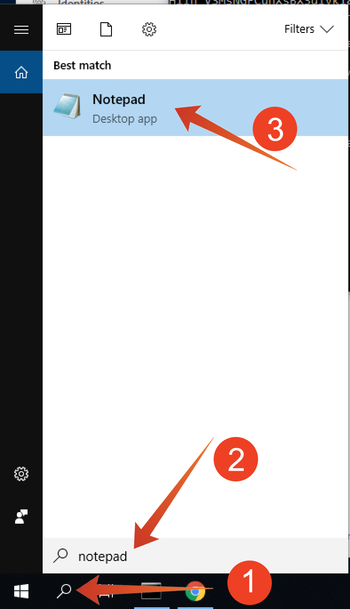
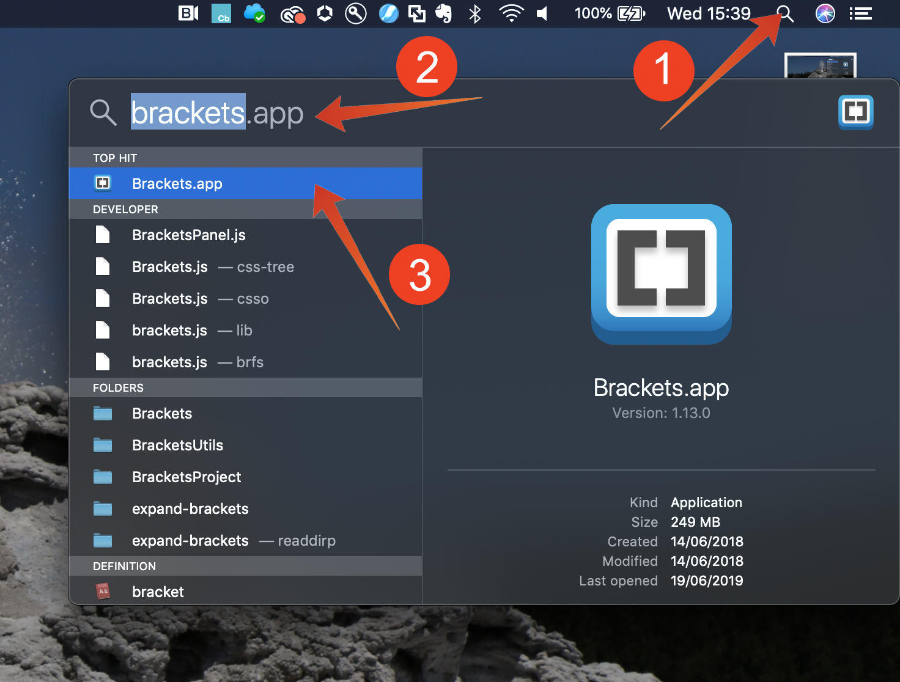
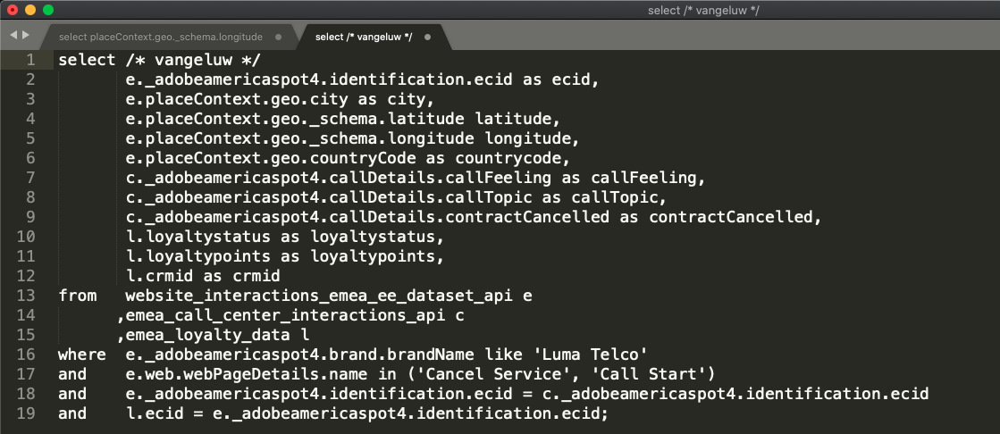

# 7.3 Queries, queries, queries...  and churn analysis

## Objective

* Write queries for data analyses
* Write SQL queries combining online, call center and loyalty data available in Adobe Experience Platform
* Learn about Adobe Defined Functions

## Context

In this exercises you will write queries to analyze product views, product funnels, churn etc.

All queries listed in this chapter will be executed in your **PSQL command-line interface**. You should copy (CTRL-c) the statement blocks indicated with **SQL** and paste (CTRL-v)them in the **PSQL command-line interface**. The **Query Result** blocks show the pasted SQL statement and the associated query result.

## 7.3.1 Write basic queries for data analysis

### Timestamp

Data captured in Adobe Experience Platform is time stamped. The **timestamp** attribute allows you to analyze data over time.

How many product views do we have on a daily basis? 

**SQL**

```sql
select date_format( timestamp , 'yyyy-MM-dd') AS Day,
       count(*) AS productViews
from   demo_system_event_dataset_for_website_global_v1_1
where  --aepTenantId--.demoEnvironment.brandName IN ('Luma Telco', 'Citi Signal')
and eventType = 'commerce.productViews'
group by Day
limit 10;
```

Copy the statement above and execute it in your **PSQL command-line interface**.

**Query Result**

```text
aepenablementfy21:all=> select date_format( timestamp , 'yyyy-MM-dd') AS Day,
aepenablementfy21:all->        count(*) AS productViews
aepenablementfy21:all-> from   demo_system_event_dataset_for_website_global_v1_1
aepenablementfy21:all-> where  --aepTenantId--.demoEnvironment.brandName IN ('Luma Telco', 'Citi Signal')
aepenablementfy21:all-> and    eventType = 'commerce.productViews'
aepenablementfy21:all-> group by Day
aepenablementfy21:all-> limit 10;
    Day     | productViews 
------------+--------------
 2020-07-31 |         2297
(1 row)
```

### Top 5 products viewed

What are the top 5 products viewed?

#### SQL

```sql
select productListItems.name, count(*)
from   demo_system_event_dataset_for_website_global_v1_1
where  --aepTenantId--.demoEnvironment.brandName IN ('Luma Telco', 'Citi Signal')
and    eventType = 'commerce.productViews'
group  by productListItems.name
order  by 2 desc
limit 5;
```

Copy the statement above and execute it in your **PSQL command-line interface**.

**Query Result**

```text
aepenablementfy21:all=> select productListItems.name, count(*)
aepenablementfy21:all-> from   demo_system_event_dataset_for_website_global_v1_1
aepenablementfy21:all-> where  --aepTenantId--.demoEnvironment.brandName IN ('Luma Telco', 'Citi Signal')
aepenablementfy21:all-> and    eventType = 'commerce.productViews'
aepenablementfy21:all-> group  by productListItems.name
aepenablementfy21:all-> order  by 2 desc
aepenablementfy21:all-> limit 5;
                 name                  | count(1) 
---------------------------------------+----------
 Google Pixel XL 32GB Black Smartphone |      938
 SIM Only                              |      482
 Samsung Galaxy S8                     |      456
 Samsung Galaxy S7 32GB Black          |      421
(4 rows)
```

### Product Interaction funnel, from viewing to buying

**SQL**

```sql
select eventType, count(*)
from   demo_system_event_dataset_for_website_global_v1_1
where  --aepTenantId--.demoEnvironment.brandName IN ('Luma Telco', 'Citi Signal')
and    eventType is not null
and    eventType <> ''
group  by eventType;
```

Copy the statement above and execute it in your **PSQL command-line interface**.

**Query Result**

```text
aepenablementfy21:all=> select eventType, count(*)
aepenablementfy21:all-> from   demo_system_event_dataset_for_website_global_v1_1
aepenablementfy21:all-> where  --aepTenantId--.demoEnvironment.brandName IN ('Luma Telco', 'Citi Signal')
aepenablementfy21:all-> and    eventType is not null
aepenablementfy21:all-> and    eventType <> ''
aepenablementfy21:all-> group  by eventType;
          eventType           | count(1) 
------------------------------+----------
 commerce.productViews        |     2297
 commerce.productListAdds     |      494
 commerce.purchases           |      246
(3 rows)
```

### Identify visitors with risk to Churn (visit page => Cancel Service)

**SQL**

```sql
select distinct --aepTenantId--.identification.core.ecid
from   demo_system_event_dataset_for_website_global_v1_1
where  --aepTenantId--.demoEnvironment.brandName IN ('Luma Telco', 'Citi Signal')
and    web.webPageDetails.name = 'Cancel Service'
group  by --aepTenantId--.identification.core.ecid
limit 10;
```

Copy the statement above and execute it in your **PSQL command-line interface**.

**Query Result**

```text
aepenablementfy21:all=> select distinct --aepTenantId--.identification.core.ecid
aepenablementfy21:all-> from   demo_system_event_dataset_for_website_global_v1_1
aepenablementfy21:all-> where  --aepTenantId--.demoEnvironment.brandName IN ('Luma Telco', 'Citi Signal')
aepenablementfy21:all-> and    web.webPageDetails.name = 'Cancel Service'
aepenablementfy21:all-> group  by --aepTenantId--.identification.core.ecid
aepenablementfy21:all-> limit 10;
               ecid               
----------------------------------
 67802232253493573025911610627278
 27147331741697745713411940873426
 19806347932758146991274525406147
 06339676267512351981624626408225
 23933440740775575701680766564499
 11860828134020790182705892056898
 04258863338643046907489131372300
 90257333076958492787834714105751
 66695181015407529430237951973742
 19103852558440070949457567094096
(10 rows)
```

In the next set of queries we will extend the above query, in order to get a complete view on the customers and their behavior that have been visiting the "Cancel Service" page. You will learn how to use the Adobe Defined Function to sessionize information, identify the sequence and timing of events. You will also join datasets together to further enrich and prepare the data for analysis in Microsoft Power BI.

## 7.3.2 Advanced Queries

The majority of the business logic requires gathering the touch-points for a customer and ordering them by time. This support is provided by Spark SQL in the form of window functions. Window functions are part of standard SQL and are supported by many other SQL engines.

### Adobe Defined Functions

Adobe has added a set of **Adobe Defined Functions** to the standard SQL syntax that allow you to better understand your experience data. In the next couple of queries you will learn about these ADF functions. You can find more information and the complete list [in the documentation](https://experienceleague.adobe.com/docs/experience-platform/query/sql/adobe-defined-functions.html).

### What do people do on the site before reaching the "Cancel Service" page as the 3rd page in a session?

With this query you will discover the first two Adobe Defined Functions **SESS_TIMEOUT** and **NEXT**

> The **SESS_TIMEOUT()** reproduces the visit groupings found with Adobe Analytics. It performs a similar time-based grouping, but customizable parameters.
>
> **NEXT()** and **PREVIOUS()** help you to understand how customers navigate your site.

**SQL**

```sql
SELECT
  webPage,
  webPage_2,
  webPage_3,
  webPage_4,
  count(*) journeys
FROM
  (
      SELECT
        webPage,
        NEXT(webPage, 1, true)
          OVER(PARTITION BY ecid, session.num
                ORDER BY timestamp
                ROWS BETWEEN CURRENT ROW AND UNBOUNDED FOLLOWING).value
          AS webPage_2,
        NEXT(webPage, 2, true)
          OVER(PARTITION BY ecid, session.num
                ORDER BY timestamp
                ROWS BETWEEN CURRENT ROW AND UNBOUNDED FOLLOWING).value
          AS webPage_3,
        NEXT(webPage, 3, true)
           OVER(PARTITION BY ecid, session.num
                ORDER BY timestamp
                ROWS BETWEEN CURRENT ROW AND UNBOUNDED FOLLOWING).value
          AS webPage_4,
        session.depth AS SessionPageDepth
      FROM (
            select a.--aepTenantId--.identification.core.ecid as ecid,
                   a.timestamp,
                   web.webPageDetails.name as webPage,
                    SESS_TIMEOUT(timestamp, 60 * 30) 
                       OVER (PARTITION BY a.--aepTenantId--.identification.core.ecid 
                             ORDER BY timestamp 
                             ROWS BETWEEN UNBOUNDED PRECEDING AND CURRENT ROW) 
                  AS session
            from   demo_system_event_dataset_for_website_global_v1_1 a
            where  a.--aepTenantId--.identification.core.ecid in ( 
                select b.--aepTenantId--.identification.core.ecid
                from   demo_system_event_dataset_for_website_global_v1_1 b
                where  b.--aepTenantId--.demoEnvironment.brandName IN ('Luma Telco', 'Citi Signal')
                and    b.web.webPageDetails.name = 'Cancel Service'
            )
        )
)
WHERE SessionPageDepth=1
and   webpage_3 = 'Cancel Service'
GROUP BY webPage, webPage_2, webPage_3, webPage_4
ORDER BY journeys DESC
LIMIT 10;
```

Copy the statement above and execute it in your **PSQL command-line interface**.

**Query Result**

```text
                webPage                |               webPage_2               |   webPage_3    | webPage_4  | journeys 
---------------------------------------+---------------------------------------+----------------+------------+----------
 Citi Signal Sport                     | Google Pixel XL 32GB Black Smartphone | Cancel Service | Call Start |        2
 SIM Only                              | Citi Signal Shop                      | Cancel Service |            |        2
 SIM Only                              | Telco Home                            | Cancel Service |            |        2
 TV & Broadband Deals                  | Samsung Galaxy S7 32GB Black          | Cancel Service |            |        2
 Telco Home                            | Citi Signal Sport                     | Cancel Service | Call Start |        2
 Google Pixel XL 32GB Black Smartphone | Broadband Deals                       | Cancel Service |            |        2
 Broadband Deals                       | Samsung Galaxy S7 32GB Black          | Cancel Service |            |        2
 Broadband Deals                       | Samsung Galaxy S8                     | Cancel Service |            |        1
 Samsung Galaxy S8                     | Google Pixel XL 32GB Black Smartphone | Cancel Service |            |        1
 SIM Only                              | Google Pixel XL 32GB Black Smartphone | Cancel Service | Call Start |        1
(10 rows)
```

### How much time do we have before a visitor calls the call center after visiting the "Cancel Service" Page?

To answer this kind of query will we use the **TIME_BETWEEN_NEXT_MATCH()** Adobe Defined Function.

> Time-between previous or next match functions provide a new dimension, which measures the time that has elapsed since a particular incident.

**SQL**

```sql
select * from (
       select --aepTenantId--.identification.core.ecid as ecid,
              web.webPageDetails.name as webPage,
              TIME_BETWEEN_NEXT_MATCH(timestamp, web.webPageDetails.name='Call Start', 'seconds')
              OVER(PARTITION BY --aepTenantId--.identification.core.ecid
                  ORDER BY timestamp
                  ROWS BETWEEN CURRENT ROW AND UNBOUNDED FOLLOWING)
              AS contact_callcenter_after_seconds
       from   demo_system_event_dataset_for_website_global_v1_1
       where  --aepTenantId--.demoEnvironment.brandName IN ('Luma Telco', 'Citi Signal')
       and    web.webPageDetails.name in ('Cancel Service', 'Call Start')
) r
where r.webPage = 'Cancel Service'
limit 15;
```

Copy the statement above and execute it in your **PSQL command-line interface**.

**Query Result**

```text
               ecid               |    webPage     | contact_callcenter_after_seconds 
----------------------------------+----------------+----------------------------------
 00331886620679939148047665693117 | Cancel Service |                                 
 00626561600197295782131349716866 | Cancel Service |                                 
 00630470663554417679969244202779 | Cancel Service |                             -797
 00720875344152796154458668700428 | Cancel Service |                             -519
 00746064605049656090779523644276 | Cancel Service |                              -62
 00762093837616944422322357210965 | Cancel Service |                                 
 00767875779073091876070699689209 | Cancel Service |                                 
 00798691264980137616449378075855 | Cancel Service |                                 
 00869613691740150556826953447162 | Cancel Service |                             -129
 00943638725078228957873279219207 | Cancel Service |                             -750
 01167540466536077846425644389346 | Cancel Service |                                 
 01412448537869549016063764484810 | Cancel Service |                                 
 01419076946514450291741574452702 | Cancel Service |                             -482
 01533124771963987423015507880755 | Cancel Service |                                 
 01710651086750904478559809475925 | Cancel Service |                                 
(15 rows)
```

### And what is the outcome of that contact?

Explain that we are joining datasets together, in this case we join our `demo_system_event_dataset_for_website_global_v1_1` with `demo_system_event_dataset_for_call_center_global_v1_1`. We do this to know the outcome of the call center interaction.

**SQL**

```sql
select distinct r.*,
       c.--aepTenantId--.interactionDetails.core.callCenterAgent.callFeeling,
       c.--aepTenantId--.interactionDetails.core.callCenterAgent.callTopic,
       c.--aepTenantId--.interactionDetails.core.callCenterAgent.callContractCancelled
from (
       select --aepTenantId--.identification.core.ecid ecid,
              web.webPageDetails.name as webPage,
              TIME_BETWEEN_NEXT_MATCH(timestamp, web.webPageDetails.name='Call Start', 'seconds')
              OVER(PARTITION BY --aepTenantId--.identification.core.ecid
                  ORDER BY timestamp
                  ROWS BETWEEN CURRENT ROW AND UNBOUNDED FOLLOWING)
              AS contact_callcenter_after_seconds
       from   demo_system_event_dataset_for_website_global_v1_1
       where  --aepTenantId--.demoEnvironment.brandName IN ('Luma Telco', 'Citi Signal')
       and    web.webPageDetails.name in ('Cancel Service', 'Call Start')
) r
, demo_system_event_dataset_for_call_center_global_v1_1 c
where r.ecid = c.--aepTenantId--.identification.core.ecid
and r.webPage = 'Cancel Service'
and c.--aepTenantId--.interactionDetails.core.callCenterAgent.callContractCancelled IN (true,false)
and c.--aepTenantId--.interactionDetails.core.callCenterAgent.callTopic IN ('contract', 'invoice','complaint','wifi')
limit 15;
```

Copy the statement above and execute it in your **PSQL command-line interface**.

**Query Result**

```text
               ecid               |    webPage     | contact_callcenter_after_seconds | callfeeling | calltopic | callcontractcancelled 
----------------------------------+----------------+----------------------------------+-------------+-----------+-----------------------
 65003638134805559755890758041032 | Cancel Service |                             -440 | negative    | contract  | true
 24197860921105808861772992106002 | Cancel Service |                             -109 | negative    | contract  | true
 96145097889556586310105454800766 | Cancel Service |                             -501 | neutral     | contract  | true
 18680613140217544548647790969994 | Cancel Service |                             -502 | negative    | contract  | true
 66121898576007921287545496624574 | Cancel Service |                             -546 | negative    | contract  | true
 35086866174626846547860375146326 | Cancel Service |                             -493 | negative    | contract  | false
 30502827193916828536733220567055 | Cancel Service |                             -924 | negative    | contract  | true
 85319114253582167371394801608573 | Cancel Service |                             -267 | positive    | contract  | true
 04258863338643046907489131372300 | Cancel Service |                             -588 | positive    | contract  | false
 23933440740775575701680766564499 | Cancel Service |                             -261 | neutral     | contract  | true
 17332005215125613039685855763735 | Cancel Service |                             -478 | neutral     | contract  | true
 02666934104296797891818818456669 | Cancel Service |                             -297 | positive    | contract  | true
 48158305927116134877913019413025 | Cancel Service |                              -47 | neutral     | contract  | false
 13294750130353985087337266864522 | Cancel Service |                              -71 | positive    | contract  | false
 69034679856689334967307492458080 | Cancel Service |                             -812 | negative    | contract  | true
(15 rows)

```

### What is the loyalty profile of these customers?

In this query we join loyalty data that we have onboarded in Adobe Experience Platform. This allows to enrich the churn analysis with loyalty data.

**SQL**

```sql
select r.*,
       c.--aepTenantId--.interactionDetails.core.callCenterAgent.callFeeling,
       c.--aepTenantId--.interactionDetails.core.callCenterAgent.callTopic,
       l.--aepTenantId--.loyaltyDetails.level,
       l.--aepTenantId--.identification.core.loyaltyId
from (
       select --aepTenantId--.identification.core.ecid ecid,
              web.webPageDetails.name as webPage,
              TIME_BETWEEN_NEXT_MATCH(timestamp, web.webPageDetails.name='Call Start', 'seconds')
              OVER(PARTITION BY --aepTenantId--.identification.core.ecid
                  ORDER BY timestamp
                  ROWS BETWEEN CURRENT ROW AND UNBOUNDED FOLLOWING)
              AS contact_callcenter_after_seconds
       from   demo_system_event_dataset_for_website_global_v1_1
       where  --aepTenantId--.demoEnvironment.brandName IN ('Luma Telco', 'Citi Signal')
       and    web.webPageDetails.name in ('Cancel Service', 'Call Start')
) r
, demo_system_event_dataset_for_call_center_global_v1_1 c
, demo_system_profile_dataset_for_loyalty_global_v1_1 l
where r.ecid = c.--aepTenantId--.identification.core.ecid
and r.webPage = 'Cancel Service'
and l.--aepTenantId--.identification.core.ecid = r.ecid
and c.--aepTenantId--.interactionDetails.core.callCenterAgent.callTopic IN ('contract', 'invoice','complaint','wifi','promo')
limit 15;
```

Copy the statement above and execute it in your **PSQL command-line interface**.

**Query Result**

```text
               ecid               |    webPage     | contact_callcenter_after_seconds | callfeeling | calltopic | level  | loyaltyid 
----------------------------------+----------------+----------------------------------+-------------+-----------+--------+-----------
 65003638134805559755890758041032 | Cancel Service |                             -440 | negative    | contract  | Gold   | 924854108
 65003638134805559755890758041032 | Cancel Service |                             -440 | negative    | contract  | Gold   | 924854108
 24197860921105808861772992106002 | Cancel Service |                             -109 | negative    | contract  | Bronze | 094259678
 24197860921105808861772992106002 | Cancel Service |                             -109 | negative    | contract  | Bronze | 094259678
 96145097889556586310105454800766 | Cancel Service |                             -501 | neutral     | contract  | Gold   | 644887358
 96145097889556586310105454800766 | Cancel Service |                             -501 | neutral     | contract  | Gold   | 644887358
 18680613140217544548647790969994 | Cancel Service |                             -502 | negative    | contract  | Gold   | 205300004
 18680613140217544548647790969994 | Cancel Service |                             -502 | negative    | contract  | Gold   | 205300004
 66121898576007921287545496624574 | Cancel Service |                             -546 | negative    | contract  | Bronze | 095728673
 66121898576007921287545496624574 | Cancel Service |                             -546 | negative    | contract  | Bronze | 095728673
 35086866174626846547860375146326 | Cancel Service |                             -493 | negative    | contract  | Bronze | 453145930
 35086866174626846547860375146326 | Cancel Service |                             -493 | negative    | contract  | Bronze | 453145930
 30502827193916828536733220567055 | Cancel Service |                             -924 | negative    | contract  | Gold   | 269406417
 30502827193916828536733220567055 | Cancel Service |                             -924 | negative    | contract  | Gold   | 269406417
 85319114253582167371394801608573 | Cancel Service |                             -267 | positive    | contract  | Bronze | 899276035
(15 rows)
```

### From what region do they visit us?

Lets include the geographical info, like longitude, attitude, city, countrycode, captured by the Adobe Experience Platform in order to get some geographical insights about churning customers.

**SQL**

```sql
       select distinct r.ecid,
              r.city,
              r.countrycode,
              r.lat as latitude,
              r.lon as longitude,
              r.contact_callcenter_after_seconds as seconds_to_contact_callcenter,
              c.--aepTenantId--.interactionDetails.core.callCenterAgent.callFeeling,
              c.--aepTenantId--.interactionDetails.core.callCenterAgent.callTopic,
              c.--aepTenantId--.interactionDetails.core.callCenterAgent.callContractCancelled,
              l.--aepTenantId--.loyaltyDetails.level,
              l.--aepTenantId--.identification.core.loyaltyId
       from (
              select --aepTenantId--.identification.core.ecid ecid,
                     placeContext.geo._schema.latitude lat,
                     placeContext.geo._schema.longitude lon,
                     placeContext.geo.city,
                     placeContext.geo.countryCode,
                     web.webPageDetails.name as webPage,
                     TIME_BETWEEN_NEXT_MATCH(timestamp, web.webPageDetails.name='Call Start', 'seconds')
                     OVER(PARTITION BY --aepTenantId--.identification.core.ecid
                         ORDER BY timestamp
                         ROWS BETWEEN CURRENT ROW AND UNBOUNDED FOLLOWING)
                     AS contact_callcenter_after_seconds
              from   demo_system_event_dataset_for_website_global_v1_1
              where  --aepTenantId--.demoEnvironment.brandName IN ('Luma Telco', 'Citi Signal')
              and    web.webPageDetails.name in ('Cancel Service', 'Call Start')
       ) r
       , demo_system_event_dataset_for_call_center_global_v1_1 c
       , demo_system_profile_dataset_for_loyalty_global_v1_1 l
       where r.ecid = c.--aepTenantId--.identification.core.ecid
       and r.webPage = 'Cancel Service'
       and l.--aepTenantId--.identification.core.ecid = r.ecid
       and c.--aepTenantId--.interactionDetails.core.callCenterAgent.callTopic IN ('contract', 'invoice','complaint','wifi','promo')
       limit 15;
```

Copy the statement above and execute it in your **PSQL command-line interface**.

**Query Result**

```text
               ecid               |   city    | countrycode |  latitude  | longitude  | seconds_to_contact_callcenter | callfeeling | calltopic | callcontractcancelled | level  | loyaltyid 
----------------------------------+-----------+-------------+------------+------------+-------------------------------+-------------+-----------+-----------------------+--------+-----------
 00630470663554417679969244202779 | Charlton  | GB          |   51.59119 |  -1.407848 |                          -797 | negative    | contract  | false                 | Bronze | 524483285
 00630470663554417679969244202779 | Charlton  | GB          |   51.59119 |  -1.407848 |                          -797 | negative    | contract  |                       | Bronze | 524483285
 00720875344152796154458668700428 | Ashley    | GB          | 51.4139633 | -2.2685462 |                          -519 | positive    | contract  | false                 | Silver | 860696333
 00720875344152796154458668700428 | Ashley    | GB          | 51.4139633 | -2.2685462 |                          -519 | positive    | contract  |                       | Silver | 860696333
 00746064605049656090779523644276 | Liverpool | GB          | 53.4913801 |  -2.867264 |                           -62 | positive    | contract  | true                  | Bronze | 072387270
 00746064605049656090779523644276 | Liverpool | GB          | 53.4913801 |  -2.867264 |                           -62 | positive    | contract  |                       | Bronze | 072387270
 00869613691740150556826953447162 | Langley   | GB          |  51.888151 |   -0.23924 |                          -129 | negative    | contract  | true                  | Bronze | 789347684
 00869613691740150556826953447162 | Langley   | GB          |  51.888151 |   -0.23924 |                          -129 | negative    | contract  |                       | Bronze | 789347684
 00943638725078228957873279219207 | Eaton     | GB          | 53.2945961 | -0.9335791 |                          -750 | positive    | contract  | false                 | Gold   | 033926162
 00943638725078228957873279219207 | Eaton     | GB          | 53.2945961 | -0.9335791 |                          -750 | positive    | contract  |                       | Gold   | 033926162
 01419076946514450291741574452702 | Tullich   | GB          | 57.4694803 | -3.1269422 |                          -482 | neutral     | contract  | false                 | Bronze | 105063634
 01419076946514450291741574452702 | Tullich   | GB          | 57.4694803 | -3.1269422 |                          -482 | neutral     | contract  |                       | Bronze | 105063634
 01738842540109643781526526573341 | Whitwell  | GB          | 54.3886617 |  -1.555363 |                          -562 | neutral     | contract  | false                 | Gold   | 791324509
 01738842540109643781526526573341 | Whitwell  | GB          | 54.3886617 |  -1.555363 |                          -562 | neutral     | contract  |                       | Gold   | 791324509
 02052460258994877317679083617975 | Edinburgh | GB          | 55.9309486 | -3.1859102 |                          -545 | neutral     | contract  | false                 | Gold   | 443477555
(15 rows)
```

## Call Center Interaction Analysis

In the queries above we only looked at the visitors that ended up contacting the call center in case of service cancellation. We want to take this a bit broader and take into account all call center interaction including (wifi, promo, invoice, complaint and contract).  

You will need to edit a query, so let's first open notepad or brackets.

On Windows click "search"-icon (1) in the windows toolbar, type **notepad** in the "search"-field (2), click (3) the "notepad" result:



On Mac



Copy the following statement to notepad/brackets:

```sql
select /* enter your name */
       e.--aepTenantId--.identification.core.ecid as ecid,
       e.placeContext.geo.city as city,
       e.placeContext.geo._schema.latitude latitude,
       e.placeContext.geo._schema.longitude longitude,
       e.placeContext.geo.countryCode as countrycode,
       c.--aepTenantId--.interactionDetails.core.callCenterAgent.callFeeling as callFeeling,
       c.--aepTenantId--.interactionDetails.core.callCenterAgent.callTopic as callTopic,
       c.--aepTenantId--.interactionDetails.core.callCenterAgent.callContractCancelled as contractCancelled,
       l.--aepTenantId--.loyaltyDetails.level as loyaltystatus,
       l.--aepTenantId--.loyaltyDetails.points as loyaltypoints,
       l.--aepTenantId--.identification.core.loyaltyId as crmid
from   demo_system_event_dataset_for_website_global_v1_1 e
      ,demo_system_event_dataset_for_call_center_global_v1_1 c
      ,demo_system_profile_dataset_for_loyalty_global_v1_1 l
where  e.--aepTenantId--.demoEnvironment.brandName IN ('Luma Telco', 'Citi Signal')
and    e.web.webPageDetails.name in ('Cancel Service', 'Call Start')
and    e.--aepTenantId--.identification.core.ecid = c.--aepTenantId--.identification.core.ecid
and    l.--aepTenantId--.identification.core.ecid = e.--aepTenantId--.identification.core.ecid;
```

And replace 

```text
enter your name
```

Do not remove `/\*` and `\*/`. Your modified statement in notepad should look like:



Copy your modified statement from **notepad** into the **PSQL command line window** and hit enter. You should see the following result in the PSQL command line window:

```text
aepenablementfy21:all=> 
aepenablementfy21:all=> select /* vangeluw */
aepenablementfy21:all->        e._experienceplatform.identification.core.ecid as ecid,
aepenablementfy21:all->        e.placeContext.geo.city as city,
aepenablementfy21:all->        e.placeContext.geo._schema.latitude latitude,
aepenablementfy21:all->        e.placeContext.geo._schema.longitude longitude,
aepenablementfy21:all->        e.placeContext.geo.countryCode as countrycode,
aepenablementfy21:all->        c._experienceplatform.interactionDetails.core.callCenterAgent.callFeeling as callFeeling,
aepenablementfy21:all->        c._experienceplatform.interactionDetails.core.callCenterAgent.callTopic as callTopic,
aepenablementfy21:all->        c._experienceplatform.interactionDetails.core.callCenterAgent.callContractCancelled as contractCancelled,
aepenablementfy21:all->        l._experienceplatform.loyaltyDetails.level as loyaltystatus,
aepenablementfy21:all->        l._experienceplatform.loyaltyDetails.points as loyaltypoints,
aepenablementfy21:all->        l._experienceplatform.identification.core.loyaltyId as crmid
aepenablementfy21:all-> from   demo_system_event_dataset_for_website_global_v1_1 e
aepenablementfy21:all->       ,demo_system_event_dataset_for_call_center_global_v1_1 c
aepenablementfy21:all->       ,demo_system_profile_dataset_for_loyalty_global_v1_1 l
aepenablementfy21:all-> where  e._experienceplatform.demoEnvironment.brandName IN ('Luma Telco', 'Citi Signal')
aepenablementfy21:all-> and    e.web.webPageDetails.name in ('Cancel Service', 'Call Start')
aepenablementfy21:all-> and    e._experienceplatform.identification.core.ecid = c._experienceplatform.identification.core.ecid
aepenablementfy21:all-> and    l._experienceplatform.identification.core.ecid = e._experienceplatform.identification.core.ecid;
               ecid               |    city    |  latitude  | longitude  | countrycode | callFeeling | callTopic | contractCancelled | loyaltystatus | loyaltypoints |   crmid   
----------------------------------+------------+------------+------------+-------------+-------------+-----------+-------------------+---------------+---------------+-----------
 33977405947573095768416894125891 | Tullich    | 57.4694803 | -3.1269422 | GB          | positive    | wifi      | false             | Bronze        |          73.0 | 904552921
 33977405947573095768416894125891 | Tullich    | 57.4694803 | -3.1269422 | GB          | positive    | wifi      | false             | Bronze        |          73.0 | 904552921
 33977405947573095768416894125891 | Tullich    | 57.4694803 | -3.1269422 | GB          | positive    | wifi      |                   | Bronze        |          73.0 | 904552921
 33977405947573095768416894125891 | Tullich    | 57.4694803 | -3.1269422 | GB          | positive    | wifi      |                   | Bronze        |          73.0 | 904552921
 67802232253493573025911610627278 | Linton     | 54.0542238 | -2.0215836 | GB          | none        | none      | false             | Silver        |         522.0 | 417981877
 67802232253493573025911610627278 | Linton     | 54.0542238 | -2.0215836 | GB          | none        | none      | false             | Silver        |         522.0 | 417981877
 67802232253493573025911610627278 | Linton     | 54.0542238 | -2.0215836 | GB          | none        | none      |                   | Silver        |         522.0 | 417981877
 67802232253493573025911610627278 | Linton     | 54.0542238 | -2.0215836 | GB          | none        | none      |                   | Silver        |         522.0 | 417981877
 27147331741697745713411940873426 | Langley    |  51.888151 |   -0.23924 | GB          | none        | none      | false             | Bronze        |         790.0 | 826545716
 27147331741697745713411940873426 | Langley    |  51.888151 |   -0.23924 | GB          | none        | none      | false             | Bronze        |         790.0 | 826545716
 27147331741697745713411940873426 | Langley    |  51.888151 |   -0.23924 | GB          | none        | none      |                   | Bronze        |         790.0 | 826545716
 27147331741697745713411940873426 | Langley    |  51.888151 |   -0.23924 | GB          | none        | none      |                   | Bronze        |         790.0 | 826545716
 19806347932758146991274525406147 | Edinburgh  | 55.9309486 | -3.1859102 | GB          | none        | none      | false             | Gold          |         981.0 | 412492571
 19806347932758146991274525406147 | Edinburgh  | 55.9309486 | -3.1859102 | GB          | none        | none      | false             | Gold          |         981.0 | 412492571
 19806347932758146991274525406147 | Edinburgh  | 55.9309486 | -3.1859102 | GB          | none        | none      |                   | Gold          |         981.0 | 412492571
 19806347932758146991274525406147 | Edinburgh  | 55.9309486 | -3.1859102 | GB          | none        | none      |                   | Gold          |         981.0 | 412492571
 06339676267512351981624626408225 | Edinburgh  | 55.9309486 | -3.1859102 | GB          | none        | none      | false             | Bronze        |         632.0 | 024761880
 06339676267512351981624626408225 | Edinburgh  | 55.9309486 | -3.1859102 | GB          | none        | none      | false             | Bronze        |         632.0 | 024761880
 06339676267512351981624626408225 | Edinburgh  | 55.9309486 | -3.1859102 | GB          | none        | none      |                   | Bronze        |         632.0 | 024761880
 06339676267512351981624626408225 | Edinburgh  | 55.9309486 | -3.1859102 | GB          | none        | none      |                   | Bronze        |         632.0 | 024761880
 23933440740775575701680766564499 | Whitwell   | 54.3886617 |  -1.555363 | GB          | neutral     | contract  | true              | Gold          |         853.0 | 696923821
 23933440740775575701680766564499 | Whitwell   | 54.3886617 |  -1.555363 | GB          | neutral     | contract  | true              | Gold          |         853.0 | 696923821
 23933440740775575701680766564499 | Whitwell   | 54.3886617 |  -1.555363 | GB          | neutral     | contract  |                   | Gold          |         853.0 | 696923821
 23933440740775575701680766564499 | Whitwell   | 54.3886617 |  -1.555363 | GB          | neutral     | contract  |                   | Gold          |         853.0 | 696923821
 11860828134020790182705892056898 | Norton     | 52.2679288 | -1.1202549 | GB          | none        | none      | false             | Gold          |         139.0 | 271933383
 11860828134020790182705892056898 | Norton     | 52.2679288 | -1.1202549 | GB          | none        | none      | false             | Gold          |         139.0 | 271933383
 11860828134020790182705892056898 | Norton     | 52.2679288 | -1.1202549 | GB          | none        | none      |                   | Gold          |         139.0 | 271933383
 11860828134020790182705892056898 | Norton     | 52.2679288 | -1.1202549 | GB          | none        | none      |                   | Gold          |         139.0 | 271933383
:
```

In the next you will persist your query (also known as **create table as select** or **CTAS**) as a new dataset that you will use in Microsoft Power BI.

Next Step: [7.4 - Power BI/Tableau](./ex4.md)

[Go Back to Module 7](./query-service.md)

[Go Back to All Modules](../../overview.md)
