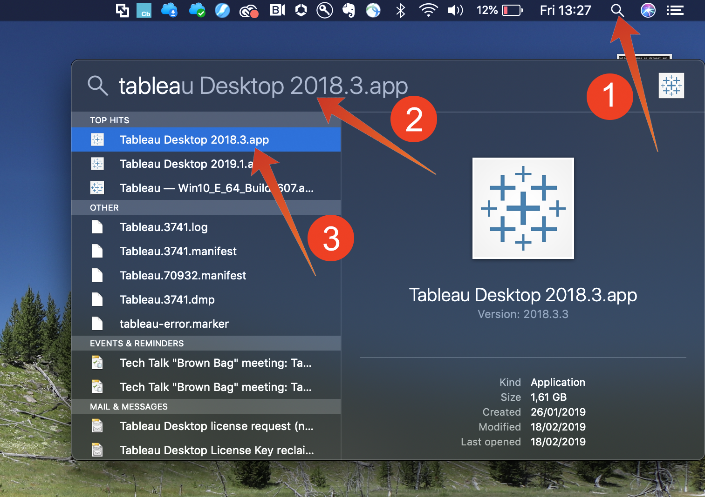
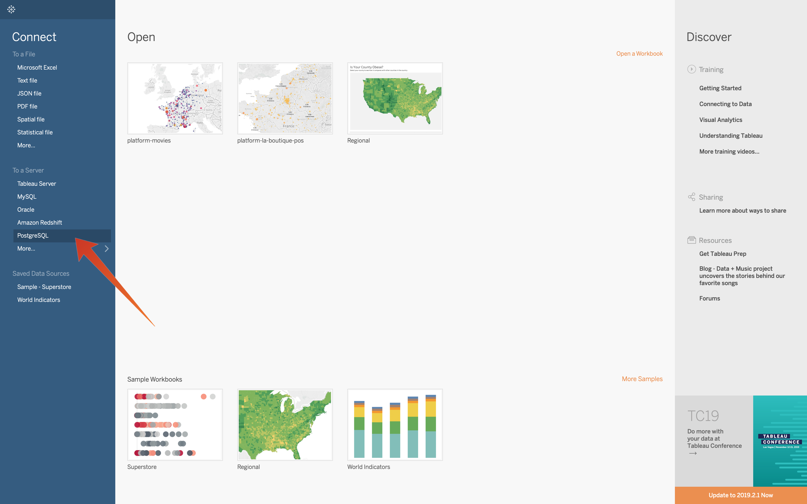
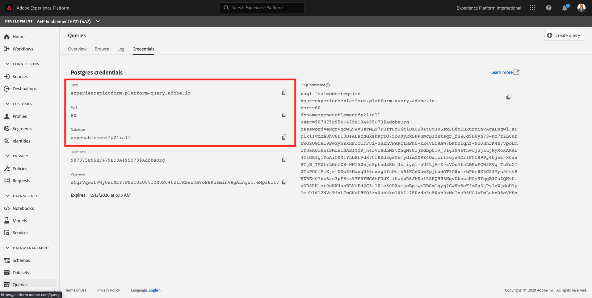
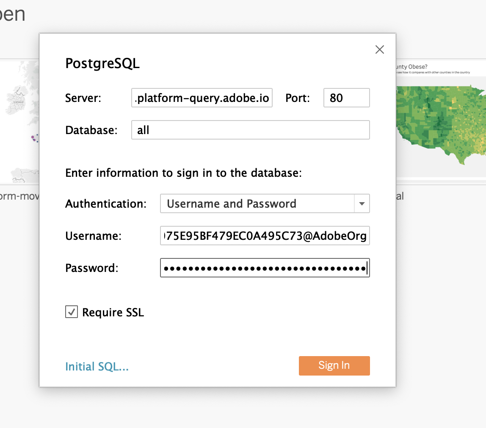
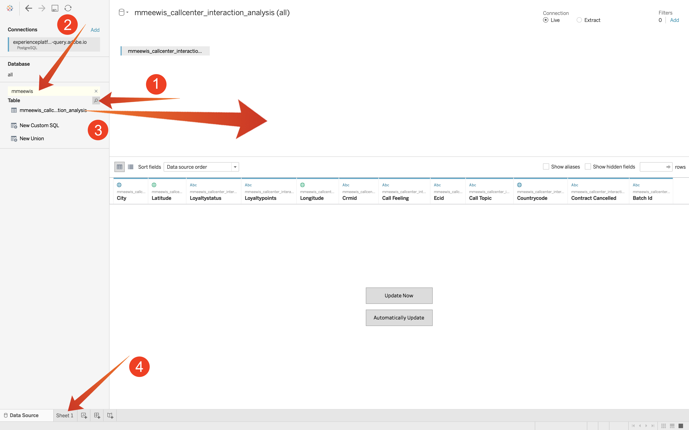
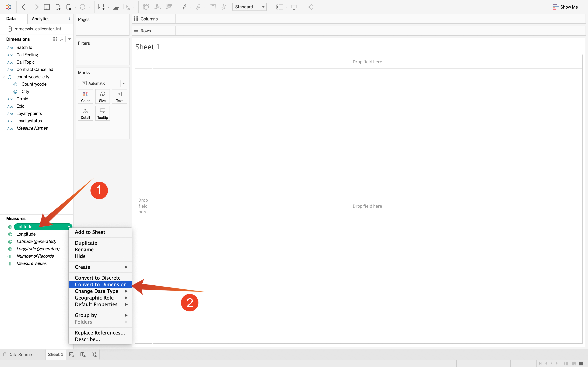
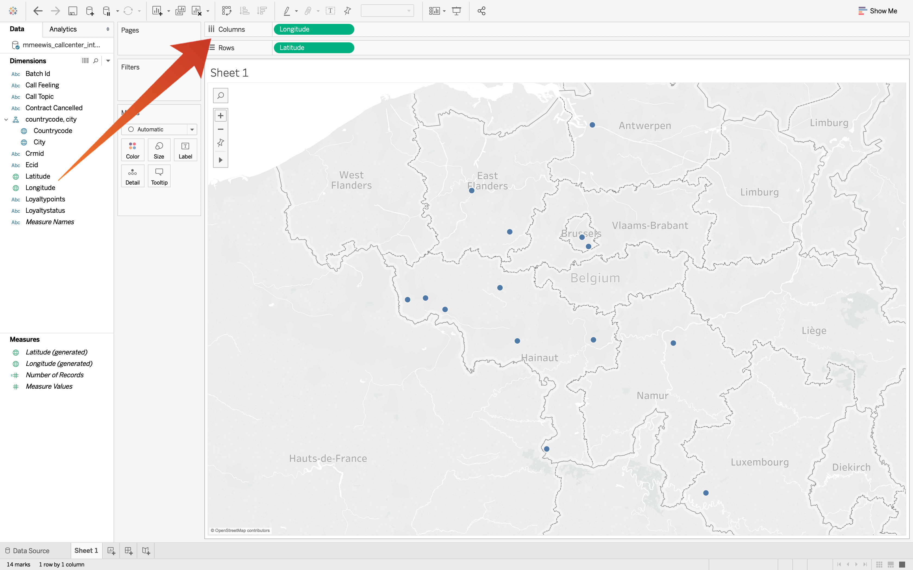
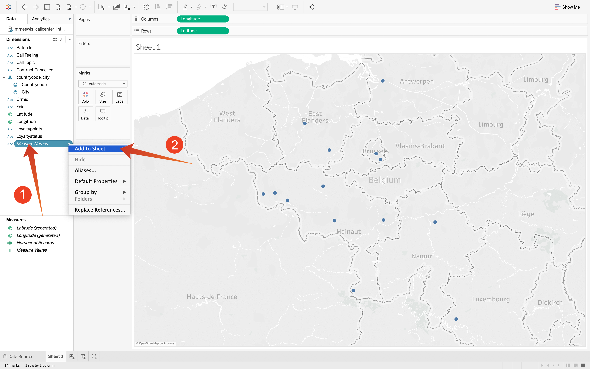
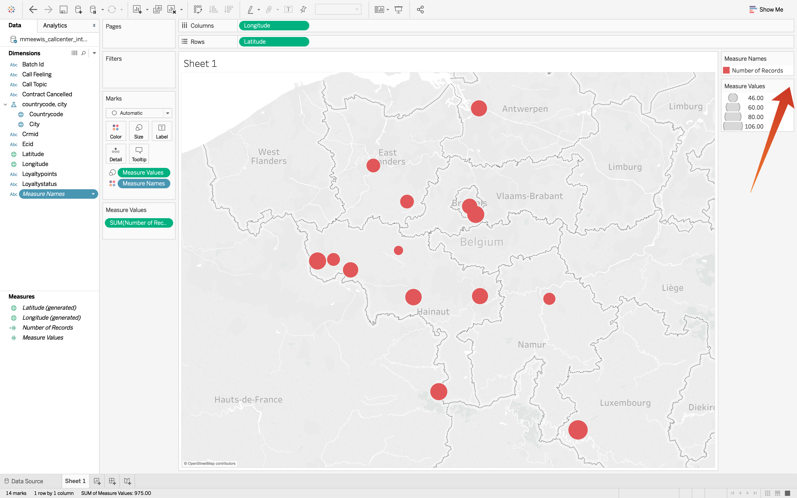
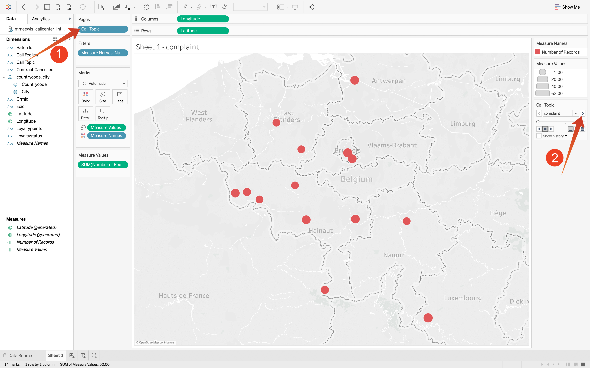

# 7.6 Query Service and Tableau

Open Tableau.

In **Connect To a Server** select **PostgreSQL**:

Go to Adobe Experience Platform, to **Queries** and to **Credentials**.

From the **Credentials** page in Adobe Experience Platform, copy the **Host** and paste it in the **Server** field, copy the **Database** and paste it in the **Database** field in Tableau, copy the **Port** and paste it in the field **Port**in Tableau, do the same for **Username** and **Password**. Next, click **Sign In**.

Sign In:

Click search (1) and enter your **ldap** into the search field, identify you table from the result set and drag (3) it onto the location named **Drag tables here**. When finished, click on **Sheet 1** (3).

To visualize our data on the map we need to convert longitude and latitude to dimensions. In **Measures** select **Latitude** (1) and open the field's dropdown and select **Convert to Dimension** (2). Do the same for the **Longitude** measure.

Drag the **Longitude** measure to the **Columns** and the **Latitude** measure to **Rows**. Automatically the map of **Belgium** will appear with little dots representing the cities in out data set.

Select **Measure Names** (1), open the dropdown and select **Add to Sheet** (2):

You will now have a map, with dots of various sizes. The size indicates the number of call center interactions for that specific city. To vary the size of the dots, navigate to the right panel and open **Measure Values** (using the drop down icon). From the drop down list select **Edit Sizes**. Play around with different sizes.

To further display the data per **Call Topic**, drag (1) the **Call Topic** dimension onto **Pages**. Navigate through the different **Call topics** using the **Call Topic** (2) on the right side of the screen:

You've now finished this exercise.

Next Step: [7.7 Query Service API](./ex7.md)

[Go Back to Module 7](./query-service.md)

[Go Back to All Modules](../../overview.md)
