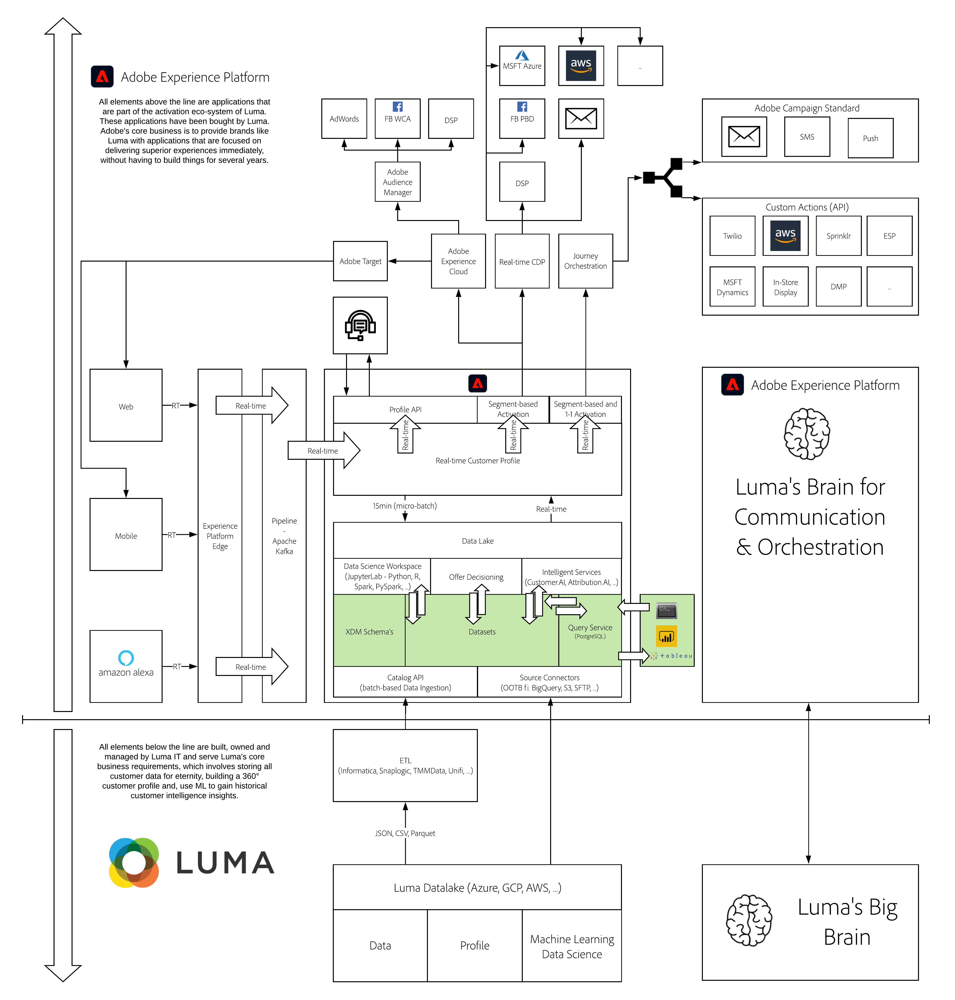

# 7. Query Service

**Authors: [Marc Meewis](https://www.linkedin.com/in/marcmeewis/), [Wouter Van Geluwe](https://www.linkedin.com/in/woutervangeluwe/)**

In this module, you will get a hands-on preview of Adobe Experience Platform Query Service. Query Service lets you perform omnichannel queries across all Adobe Experience Cloud application data, joining and analyzing data across Adobe Campaign, Analytics, Audience Manager, Target, and Advertising Cloud and other customer data loaded/inserted into Adobe Experience Platform.

Query Service is a serverless tool. It supports SQL queries and connectivity from multiple client applications through its PostgreSQL compatibility.
We will use data that has been injected into platform using either Web Interaction Data, Call Center Interactions in combination with Customer Loyalty Data uploaded into platform.

## Learning Objectives

- Become familiar with the Adobe Experience Platform UI
- Connect to Query Service and run your SQL queries
- Explore datasets in Adobe Experience Platform
- Connect Tableau or Power BI to the Adobe Experience Platform Query Service to create visualizations and reports

## Prerequisites

- Some familiarity with SQL is preferred, but not required
- Access to Adobe Experience Platform: [https://experience.adobe.com/platform](https://experience.adobe.com/platform)
- Datasets (dataset used during lab, pre-loaded for you)
- PostgreSQL
- Tableau or Microsoft Power BI Desktop
- **Download these assets**: 
  - [JSON - Sample Data: Website Interactions](./../../assets/json/m7_ee.json)
  - [JSON - Sample Data: Call Center Interactions](./../../assets/json/m7_callcenter.json)
  - [JSON - Sample Data: Loyalty](./../../assets/json/m7_loyalty.json)

>[!IMPORTANT] 
>
>This tutorial was created to facilitate a particular workshop format. It uses specific systems and accounts to which you might not have access. Even without access, we think you can still learn a lot by reading through this very detailed content. If you're a participant in one of the workshops and need your access credentials, please contact your Adobe representative who will provide you with the required information.

## Architecture Overview

Have a look at the below architecture, which highlights the components that will be discussed and used in this module.

## Sandbox to use

For this module, please use this sandbox: `--module7sandbox--`.

>[!NOTE]
>
>Don't forget to install, configure and use the Chrome Extension as referenced in [0.6 - Install the Chrome extension for the Experience League documentation](../module0/ex6.md)

## Exercises

[7.0 Prerequisites](./ex0.md)

You will need to install PSQL to execute the queries in this enablement exercise. Depending on your operating system you will have to install Microsoft Power BI or Tableau. Windows users can choose between Power BI or Tableau. Mac users should install Tableau.

[7.1 Getting Started](./ex1.md)

In this exercise you will explore the Adobe Experience Platform Query Service User Interface, learn about data sets, find your queries and finally setup a connection from PSQL.

[7.2 Using the Query Service](./ex2.md)

In this exercise you will learn about the basic Query Service syntax and you can identify the attributes of the XDM schema in your query.

[7.3 Queries, queries, queries...  and churn analysis](./ex3.md)

In this exercise you will be doing queries, you will learn about the Adobe Defined Functions while doing some churn analysis. At the end of this you will write a query to prepare a dataset for use in Microsoft Power BI.

[7.4 Generate a dataset from a query](./ex4.md)

In this exercise you will generate a dataset from a query executed in the previous and you will use this dataset in the next exercises.

[7.5 Query Service and Power BI](./ex5.md)

In this exercise, you'll connect Power BI to Adobe Experience Platform and Query Service to perform Callcenter Interaction Analysis.

[7.6 Query Service and Tableau](./ex6.md)

In this exercise, you'll connect Tableau to Adobe Experience Platform and Query Service to perform Callcenter Interaction Analysis.

[7.7 Query Service API](./ex7.md)

In this exercise you'll use the Query Service API to manage query templates and query schedules.

[Summary and benefits](./summary.md)

Summary of this module and overview of the benefits.

>[!NOTE]
>
>Thank you for investing your time in learning all there is to know about Adobe Experience Platform. If you have questions, want to share general feedback of have suggestions on future content, please contact Wouter Van Geluwe directly, by sending an email to **vangeluw@adobe.com**.

[Go Back to All Modules](../../overview.md)
