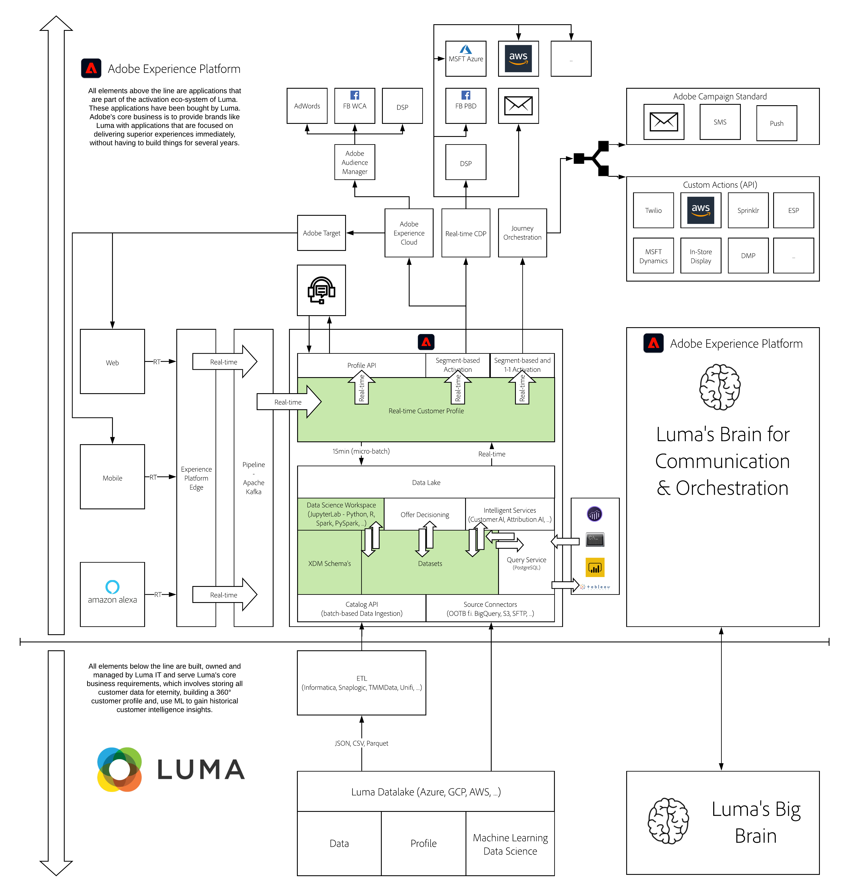

# 8. Data Science Workspace - Popularity Based Recommendations

**Authors: [Jo O'Connor](https://www.linkedin.com/in/jcoc17/), [Jonathan Lancar](https://www.linkedin.com/in/jonathanlancar/), [Wouter Van Geluwe](https://www.linkedin.com/in/woutervangeluwe/)**

In this module, you'll learn how to create a simple Machine Learning model that generates personalized product recommendations using Data Science Workspace. When customers visit a retail website like Luma and click on a product, they should be presented with personalized product recommendations afterwards.

## Learning Objectives

- Become familiar with the Adobe Experience Platform UI
- Explore Adobe Experience Platform Data Science Workspace
- Analyze and transform your data.
- Author a model and operationalize it
- Train your model and experiment
- Score your model and consume the insights

## Prerequisites

- Access to Adobe Experience Platform: [https://experience.adobe.com/platform](https://experience.adobe.com/platform)

>[!IMPORTANT]
>
>This tutorial was created to facilitate a particular workshop format. It uses specific systems and accounts to which you might not have access. Even without access, we think you can still learn a lot by reading through this very detailed content. If you're a participant in one of the workshops and need your access credentials, please contact your Adobe representative who will provide you with the required information.

## Architecture Overview

Have a look at the below architecture, which highlights the components that will be discussed and used in this module.

## Sandbox to use

For this module, please use this sandbox: `--aepSandboxId--`.

>[!NOTE]
>
>Don't forget to install, configure and use the Chrome Extension as referenced in [0.6 - Install the Chrome extension for the Experience League documentation](../module0/ex6.md)

## Exercises

[8.1 Data Exploration and Transformation](./ex1.md)

To create a machine learning model that will recommend products that users might like when they are looking at a particular product, you need to analyze previous purchases made by users on the website. In this lesson, you'll explore purchase data flowing via tags and Web SDK to Adobe Experience Platform and transform that data into a feature dataset that will be used to train your machine learning model.

[8.2 Model Authoring and Operationalization](./ex2.md)

In this lesson you'll learn how you can use this data and author a machine learning model. In the real world, creating a dataset and a machine learning model will be an iterative process.

[8.3 Model Training and Experimentation](./ex3.md)

So you’ve prepared your data, authored your model and packaged it to test it at scale as a recipe. Now let’s go ahead and train and test the model at scale.

[8.4 Scoring and Consumption of Insights](./ex4.md)

Now that you've experimented with your recommendations model and have determined the optimal run, you can move on to scoring the model to generate product recommendations for customers.

[Summary and benefits](./summary.md)

Summary of this module and overview of the benefits.

>[!NOTE]
>
>Thank you for investing your time in learning all there is to know about Adobe Experience Platform. If you have questions, want to share general feedback of have suggestions on future content, please contact Wouter Van Geluwe directly, by sending an email to **vangeluw@adobe.com**.

[Go Back to All Modules](../../overview.md)
