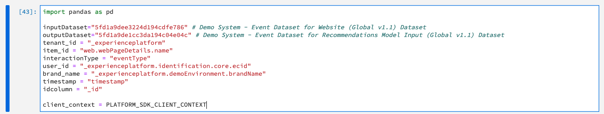
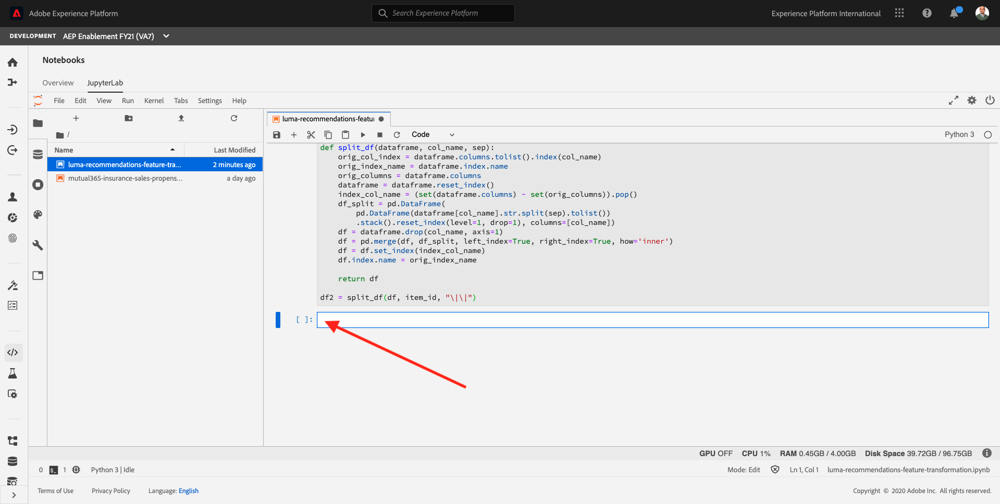

# 8.1 Data Exploration and Transformation

To create a machine learning model that will recommend products that users might like when they are looking at a particular product, you need to analyze previous purchases made by users on the website. In this lesson, you will explore purchase data flowing via Adobe Analytics to Platform and transform that data into a Feature dataset that can help train your machine learning model.

The URL to login to Adobe Experience Platform is: [https://experience.adobe.com/platform](https://experience.adobe.com/platform)

## 8.1.1 Explore the Datasets and XDM Schemas

Experience Data Models (XDM) on Adobe Experience Platform help standardize your data so that it can be used efficiently across your organization.

Log in to [Adobe Experience Platform](https://experience.adobe.com/platform).

After logging in, you'll land on the homepage of Adobe Experience Platform.


Before you continue, you need to select a **sandbox**. The sandbox to select is named ``--aepSandboxId--``. You can do this by clicking the text **[!UICONTROL Production Prod]** in the blue line on top of your screen.


After selecting the appropriate sandbox, you'll see the screen change and now you're in your dedicated sandbox.


From the left menu, click **Datasets**.


To develop a product recommendations machine learning model, we are interested in products that users have purchased previously with Luma. To streamline the data required to train our machine learning model, we have created a simple schema called Recommendations Input Schema as outlined in the table below (key fields: userid – the user who interacted with the Luma Website, timestamp – time of interaction, interactiontype – Purchase, itemid – product that the user interacted with).

In this tutorial, we'll use three datasets:

| Dataset Name                   | Dataset Schema      | Description                                    |
|:---------------------------:| :---------------:| :-------------------------------------: |
| Demo System - Event Dataset for Website (Global v1.1) | Demo System - Event Dataset for Website (Global v1.1) Schema | Clickstream data from website |
| Demo System - Event Dataset for Recommendations Model Input (Global v1.1) | Demo System - Event Schema for Recommendations Model Input (Global v1.1) | The clickstream data will be converted into a feature/training dataset using a feature pipeline. This data is used to train the Product Recommendations machine learning model. itemid and userid correspond to a product purchased by that user at time timestamp |
| Demo System - Profile Dataset for ML Predictions (Global v1.1) | Demo System - Profile Schema for ML Predictions (Global v1.1) | Schema This is the dataset that you obtain after scoring. This contains the list of recommended products for each user |

Let's have a look at the **Demo System - Event Dataset for Website (Global v1.1)** dataset.

On the Datasets - page, enter **Demo System - Event Dataset for Website** in the search box.


Open the dataset **Demo System - Event Dataset for Website (Global v1.1)**.


By clicking the **Preview Dataset** button, you can see what data is sent into that dataset and how the data model looks like. FYI - your data in your dataset may look different. That's normal and expected.


Close the preview window of your dataset.

Let's have a look at the schema that was defined for this dataset.

From the left menu, select **Schemas**.


In the Schemas overview, search to find the 3 schemas you'll be using in this lab.

| Schema Name    |
| :---------------:|
| Demo System - Event Schema for Recommendations Model Input (Global v1.1) |
| Demo System - Profile Schema for ML Predictions (Global v1.1) |
| Demo System - Event Schema for Website (Global v1.1) |

Click to open the schema named **Demo System - Event Schema for Website (Global v1.1)**.


## 8.1.2 Open Jupyter Notebooks

Let's get your hands dirty now, by going to Jupyter Notebooks.

In the left menu, click on **Notebooks**.


Click on **JupyterLab**. You'll now see JupyterLab loading. This may take 1-2 minutes.


Once Jupyter Notebooks is running, you can continue with the next step.


## 8.1.3 Transform Clickstream Data

Jupyter Notebooks is running so you can start the process of building up your notebook and adding the code you need to transform clickstream data into a usable dataset that is ready for training.


In Jupyter Notebooks, open a blank **Python 3** notebook clicking the Blank button on the Launcher.


You'll then have a blank, empty new Python 3 notebook. Before you continue, give your notebook a descriptive name. Right-click on the **Untitled.ipynb** file and click **Rename**.


Enter **luma-recommendations-feature-transformation.ipynb** as the name for your notebook and hit **Enter**. You'll then have this:


What you'll do next:

- Define the input and output datasets for this Notebook
- Read form Platform: Load the input dataset and describe it
- Filter out empty values
- Split the item_id into individual records
- Create a new data-frame that holds the data that we need for our model
- Write to Platform: Output that data-frame into a dataset in Adobe Experience Platform

### Define the input and output datasets for this Notebook

Click in the first cell in the notebook.


Copy the below code and paste it in the first cell in your notebook.

```python
import pandas as pd

inputDataset="--aepWebsiteInteractionsDatasetId--" # Demo System - Event Dataset for Website (Global v1.1) Dataset
outputDataset="--aepRecommendationsInputDatasetId--" # Demo System - Event Dataset for Recommendations Model Input (Global v1.1)
tenant_id = "--aepTenantId--"
item_id = "web.webPageDetails.name"
interactionType = "eventType"
user_id = "--aepTenantId--.identification.core.ecid"
brand_name = "--aepTenantId--.demoEnvironment.brandName"
timestamp = "timestamp"
idcolumn = "_id"

client_context = PLATFORM_SDK_CLIENT_CONTEXT
```

>[!IMPORTANT]
>
>The environment variables **aepWebsiteInteractionsDatasetId** and **aepRecommendationsInputDatasetId** refer to dataset IDs of datasets that have been created in your Adobe Experience Platform instance. 
>
>**aepWebsiteInteractionsDatasetId** refers to the dataset ID of the dataset **Demo System - Event Dataset for Website (Global v1.1)**, **aepRecommendationsInputDatasetId** refers to the dataset ID of the dataset **Demo System - Event Dataset for Recommendations Model Input (Global v1.1)**. Replace the environment variables by the dataset IDs when you paste the code in the first cell in your notebook.

You'll then have this in cell 1:



Click the play button to execute this cell.


The execution of this cell might a couple of seconds to minutes. Just wait and don't do anything else in this notebook until you the below result.

Every time you push the play-button to execute a cell, you'll see an indicator that tells you whether or not your action is still ongoing.

This is the indicator when you push the play button to execute a cell:


This is the indicator when the cell has been executed and the action has finished:


Don't continue the exercises until the indicator shows that the execution is finished. If you don't wait for your execution to finish, you'll get stuck and receive many errors in the next steps. This is applicable to the execution of all cells in any Jupyter Notebook: always wait until the execution is done and you see the indicator changes and looks like this:


There is no visual result after the execution of cell 1. After clicking the play button, continue to the next step.

### Read from Platform: Load the input dataset and show an overview of the data

Click in the next empty cell in the notebook.


Copy the below code and paste it in the next empty cell in your notebook.

```python
from platform_sdk.dataset_reader import DatasetReader

dataset_reader = DatasetReader(client_context, inputDataset)
df = dataset_reader.limit(1000).read()
df.head()
```

You'll then have this in that cell:


Click the play button to execute this cell.

The execution of this cell might take 1-2 minutes. Just wait and don't do anything else in this notebook until you the below result.


Wait until the indicator looks like this before continuing:


The result will look like this (but won't be identical - you may have more or less data available in your Adobe Experience Platform instance):


### Filter out empty values and select data for brand Luma

Click in the next empty cell in the notebook.


Copy the below code and paste it in the next empty cell in your notebook.

```python
# drop nulls
df = df.dropna(subset=[user_id, item_id, interactionType, brand_name])

# only focus on one brand
df = df[df[brand_name].isin(["Luma", "Luma Retail"])]

# filter out product views
df = df[df[interactionType].isin(["commerce.productViews"])]
```

You'll then have this in that cell:


Click the play button to execute this cell.


Wait until the indicator looks like this before continuing:


There is no visual result after this execution. After clicking the play button, continue to the next step.

### Split the items into individual records

Click in the next empty cell in the notebook.


Copy the below code and paste it in the next empty cell in your notebook.

```python
# vectorized (no loops) solution for splitting in pandas
# source: https://stackoverflow.com/a/48120674
def split_df(dataframe, col_name, sep):
    orig_col_index = dataframe.columns.tolist().index(col_name)
    orig_index_name = dataframe.index.name
    orig_columns = dataframe.columns
    dataframe = dataframe.reset_index()
    index_col_name = (set(dataframe.columns) - set(orig_columns)).pop()
    df_split = pd.DataFrame(
        pd.DataFrame(dataframe[col_name].str.split(sep).tolist())
        .stack().reset_index(level=1, drop=1), columns=[col_name])
    df = dataframe.drop(col_name, axis=1)
    df = pd.merge(df, df_split, left_index=True, right_index=True, how='inner')
    df = df.set_index(index_col_name)
    df.index.name = orig_index_name

    return df

df2 = split_df(df, item_id, "\|\|")
```

You'll then have this in that cell:


Click the play button to execute this cell.


The execution of this cell might take 1-2 minutes. Just wait and don't do anything else in this notebook until you the below result.

Wait until the indicator looks like this before continuing:


There is no visual result after this execution. After clicking the play button, continue to the next step.

### Prep the data before saving it back to Adobe Experience Platform

Click in the next empty cell in the notebook.



Copy the below code and paste it in the next empty cell in your notebook.

```python
filtered_column_list = [idcolumn, item_id, user_id, interactionType, brand_name, timestamp]

df2 = df2[filtered_column_list]

df2.rename(columns={
    item_id: tenant_id + ".recommendationsInput" + ".productSku",
    user_id: tenant_id + ".recommendationsInput" + ".ecid",
    interactionType: tenant_id + ".recommendationsInput" + ".interactionType",
    brand_name: tenant_id + ".recommendationsInput" + ".brandName"
}, inplace=True)
```

You'll then have this in that cell:


Click the play button to execute this cell.


The execution of this cell might take 1-2 minutes. Just wait and don't do anything else in this notebook until you the below result.

Wait until the indicator looks like this before continuing:


There is no visual result after this execution. After clicking the play button, continue to the next step.

### Write to Platform: Output that data-frame into a dataset in Adobe Experience Platform

Click in the next empty cell in the notebook.


Copy the below code and paste it in the next empty cell in your notebook.

```python
df2.head()
```

You'll then have this in that cell:


Click the play button to execute this cell.


Wait until the indicator looks like this before continuing:


The result looks like this:


Click in the next empty cell in the notebook.


Copy the below code and paste it in the next empty cell in your notebook.

```python
df2['timestamp'] = pd.to_datetime(df2['timestamp']).apply(lambda x: x.isoformat())

from platform_sdk.models import Dataset
from platform_sdk.dataset_writer import DatasetWriter
dataset = Dataset(PLATFORM_SDK_CLIENT_CONTEXT).get_by_id(dataset_id=outputDataset)
dataset_writer = DatasetWriter(PLATFORM_SDK_CLIENT_CONTEXT, dataset)
write_tracker = dataset_writer.write(df2, file_format='json')
```

You'll then have this in that cell:


Click the play button to execute this cell.


Wait until the indicator looks like this before continuing:


The result looks like this:


The result in Adobe Experience Platform is that a new batch of data has been created on the **Demo System - Event Dataset for Recommendations Model Input (Global v1.1)** which you can verify by going
[here](https://experience.adobe.com/platform/dataset/browse?limit=50&page=1&sortDescending=1&sortField=created).


Next Step: [8.2 - Model Authoring and Operationalization](./ex2.md)

[Go Back to Module 8](./data-science-workspace-popularity-based-recommendations.md)

[Go Back to All Modules](../../overview.md)
