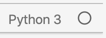
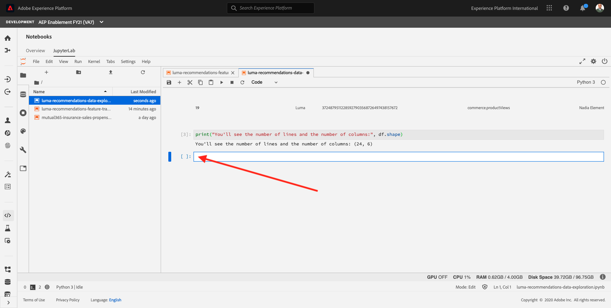

# 8.2 Model Authoring and Operationalization

In Exercise 8.1 you generated the training data required to power your machine learning model. In this lesson you'll learn you how you can use this data to author a machine learning model. In the real world, creating a dataset and a machine learning model will be an iterative process.

The URL to login to Adobe Experience Platform is: [https://experience.adobe.com/platform](https://experience.adobe.com/platform).

## Objectives

- Analyze your training data using Notebooks
- Explore the Product Recommendations Recipe
- Learn how the Product Recommendations Recipe can be created

## 8.2.1 Analyze the Data

In Jupyter Notebooks, open the **Launcher** page by clicking the **+** icon in the taskbar.


You'll then see this:


Open a blank **Python 3** notebook by clicking the Blank button on the Launcher.


You'll then have a blank, empty new Python 3 notebook. Before you continue, give your notebook a descriptive name. Right-click on the **Untitled.ipynb** file and click **Rename**.


Enter **luma-recommendations-data-exploration.ipynb** as the name for your notebook and hit **Enter**. You'll then have this:


### Load Libraries

Click in the first empty cell in the notebook.


Copy the below code and paste it in the first cell in your notebook.

```python
import numpy as np
import pandas as pd
import matplotlib.pyplot as plt
import seaborn as sns
from sklearn import model_selection, linear_model, tree
from sklearn.ensemble import RandomForestRegressor, GradientBoostingRegressor
from sklearn.neighbors import KNeighborsRegressor
import warnings; warnings.simplefilter('ignore')
%matplotlib inline
sns.set()
seed = 1234
inputDataset="--aepRecommendationsInputDatasetId--" # Demo System - Event Dataset for Recommendations Model Input (Global v1.1)
```

>[!IMPORTANT]
>
>The environment variable **aepRecommendationsInputDatasetId** refers to a dataset ID of a dataset that has been created in your Adobe Experience Platform instance. 
>
>**aepRecommendationsInputDatasetId** refers to the dataset ID of the dataset **Demo System - Event Dataset for Recommendations Model Input (Global v1.1)**. Replace the environment variable by that dataset IDs when you paste the code in the first cell in your notebook.

You'll then have this in cell 1:


Click the play button to execute this cell.


Wait until the indicator looks like this before continuing:



The result looks like this:


### Load Data

Click in the next empty cell in your notebook.


Copy the below code and paste it in the first cell in your notebook.

```python
from platform_sdk.dataset_reader import DatasetReader
from datetime import date
dataset_reader = DatasetReader(PLATFORM_SDK_CLIENT_CONTEXT, dataset_id=inputDataset)
df = dataset_reader.limit(100).read()

df.head(20)
```

You'll then have this in that cell:


Click the play button to execute this cell.


The execution of this cell might take 1-2 minutes. 

Wait until the indicator looks like this before continuing:


This is the result:


### Summarize the Data

Click in the next empty cell in your notebook.


Copy the below code and paste it in the first cell in your notebook.

```python
print("You'll see the number of lines and the number of columns:", df.shape)
```

You'll then have this in that cell:


Click the play button to execute this cell.


This is the result:


### Statistical Summary

Click in the next empty cell in your notebook.



Copy the below code and paste it in the first cell in your notebook.

```python
user_id = '--aepTenantId--.recommendationsInput.ecid'
item_id = '--aepTenantId--.recommendationsInput.productSku'
interaction_type = '--aepTenantId--.interactionType'
timestamp = '--aepTenantId--.timestamp'
```

You'll then have this in that cell:


Click the play button to execute this cell.


Then click in the next empty cell in your notebook.


Copy the below code and paste it in the first cell in your notebook.

```python
df.describe()
```

You'll then have this in that cell:


Click the play button to execute this cell.


This is the result:


### Grouping Items by Item ID

Click in the next empty cell in your notebook.


Copy the below code and paste it in the first cell in your notebook.

```python
df[[user_id, item_id]].groupby([item_id]).agg(['count'])
```

You'll then have this in that cell:


Click the play button to execute this cell.


This is the result:


## 8.2.2 Recipe Builder Notebook

The Recipe Builder Notebook is one of our recent innovations that templates your model to automatically package and operationalize it. The notebook has multiple templated cells that you fit your model code into:

- The requirements and configuration cells allow you to add additional libraries and configure datasets and tuning parameters for your model
- The evaluator cell enables you to split your data and evaluate the performance of your model
- The training and scoring data loader cells allow you to load the data you need for training and scoring
- Finally, the pipeline cell contains logic required for both training and scoring your model.

We have streamlined the steps needed to operationalize a model by giving you the ability to train, evaluate and score it at scale and then package it in one seamless flow on Adobe Experience Platform. Packaging to a Recipe also allows you to use the same code with different datasets to power different use cases in your organizations. Our specific use case revolves around using the recommendations model code for users searching for products to purchase on the website.

In Jupyter Notebooks, open the **Launcher** page by clicking the **+** icon in the taskbar.


You'll then see this:


Open a blank **Recipe Builder** notebook by clicking the Recipe Builder button on the Launcher.


You'll then have a blank, empty new Recipe Builder notebook. Before you continue, give your notebook a descriptive name. Right-click on the **[Python 3] Recipe Builder.ipynb** file and click **Rename**.


Enter **luma-recommendations-popularity-recipe.ipynb** as the name for your notebook and hit **Enter**. You'll then have this:


In this notebook, you'll do the following:

- Train a model
- Score a model
- Create a recipe from the model

Let's configure all steps in detail.

### Configuration Files

Scroll down in the Recipe Builder notebook until you see **Configuration Files**.


You now need to update the cells for **Training Configuration** and **Scoring Configuration**.

#### Training Configuration

Click in the cell for **Training Configuration**. 

Before you do anything, please pay attention!! Whatever you do, don't delete or overwrite the line that starts with **%%writefile**. This line is required by the Recipe Builder notebook.

```python
%%writefile ~/my-workspace/.recipes/recipe-pt9c03C_w/training.conf
```


You'll also see similar code in that same cell:

```python
{
   "trainingDataSetId": "<replace with training dataset id>",
   "ACP_DSW_TRAINING_XDM_SCHEMA": "<replace with training xdm schema id>",
   "tenantId": "_<tenant_id>", 
   "learning_rate": "0.1",
   "n_estimators": "100",
   "max_depth": "3"
}
```

Replace that code by this code:

```python
{
   "tenant_id": "--aepTenantId--",
   "trainingDataSetId": "--aepRecommendationsInputDatasetId--",
   "ACP_DSW_TRAINING_XDM_SCHEMA": "https://ns.adobe.com/--aepTenantIdSchema--/schemas/--aepRecommendationsInputSchemaRef--",
   "num_recommendations": "5",
   "sampling_fraction": "0.5"
}
```

>[!IMPORTANT]
>
>The environment variables **aepRecommendationsInputDatasetId** and **aepRecommendationsInputSchemaRef** refer to dataset IDs of datasets that have been created in your Adobe Experience Platform instance. 
>
>**aepRecommendationsInputDatasetId** refers to the dataset ID of the dataset **Demo System - Event Dataset for Recommendations Model Input (Global v1.1)**, **aepRecommendationsInputSchemaRef** refers to the Schema Ref ID of the schema **Demo System - Event Schema for Recommendations Model Input (Global v1.1)**. Replace the environment variables by the dataset ID and Schema Ref ID when you paste the code in the **Training Configuration** cell in your notebook.

You should now have something similar in the **Training Configuration** cell:


#### Scoring Configuration

Click in the cell for **Scoring Configuration**. 

Before you do anything, please pay attention!! Whatever you do, don't delete or overwrite the line that starts with **%%writefile**. This line is required by the Recipe Builder notebook.

```python
%%writefile ~/my-workspace/.recipes/recipe-pt9c03C_w/scoring.conf
```


You'll also see similar code in that same cell:

```python
{
   "scoringDataSetId": "<replace with scoring input dataset id>",
   "scoringResultsDataSetId": "<replace with scoring results dataset id>",
   "ACP_DSW_SCORING_RESULTS_XDM_SCHEMA": "<replace with scoring results xdm schema id>",
   "tenantId": "_<tenant_id>"
}
```

Replace that code by this code:

```python
{
   "tenant_id": "--aepTenantId--",
   "scoringDataSetId": "--aepRecommendationsInputDatasetId--",
   "scoringResultsDataSetId": "--aepMlPredictionsDatasetId--",
   "ACP_DSW_SCORING_RESULTS_XDM_SCHEMA": "https://ns.adobe.com/--aepTenantIdSchema--/schemas/--aepMlPredictionsSchemaRef--" 
}
```

>[!IMPORTANT]
>
>The environment variables **aepRecommendationsInputDatasetId**, **aepMlPredictionsDatasetId** and **aepMlPredictionsSchemaRef** refer to dataset IDs of datasets and Schema Ref ID of schemas that have been created in your Adobe Experience Platform instance. 
>
>**aepRecommendationsInputDatasetId** refers to the dataset ID of the dataset **Demo System - Event Dataset for Recommendations Model Input (Global v1.1)**, **aepMlPredictionsDatasetId** refers to the dataset ID of the dataset **Demo System - Profile Dataset for ML Predictions (Global v1.1)**, **aepMlPredictionsSchemaRef** refers to the Schema Ref ID of the schema **Demo System - Profile Schema for ML Predictions (Global v1.1)**. Replace the environment variables by the dataset ID and Schema Ref ID when you paste the code in the **Scoring Configuration** cell in your notebook.

You should now have something similar in the **Scoring Configuration** cell:


### Training Data Loader File

Scroll down in the Recipe Builder notebook until you see **Training Data Loader File**.


You now need to update the code for **Training Data Loader File**.

Before you do anything, please pay attention!! Whatever you do, don't delete or overwrite the line that starts with **%%writefile**. This line is required by the Recipe Builder notebook.


In that cell, you'll find code similar to this:

```python
import pandas as pd
from datetime import datetime, timedelta
from platform_sdk.dataset_reader import DatasetReader
from .utils import get_client_context

def load(config_properties):
    print("Training Data Load Start")

    #########################################
    # Load Data
    #########################################    
    client_context = get_client_context(config_properties)
    
    dataset_reader = DatasetReader(client_context, config_properties['trainingDataSetId'])
    
    timeframe = config_properties.get("timeframe")
    tenant_id = config_properties.get("tenant_id")
    
    if (timeframe is not None):
        date_before = datetime.utcnow().date()
        date_after = date_before - timedelta(minutes=int(timeframe))
        dataframe = dataset_reader.where(dataset_reader[tenant_id + '.date'].gt(str(date_after)).And(dataset_reader[tenant_id + '.date'].lt(str(date_before)))).read()
    else:
        dataframe = dataset_reader.read()

    if '_id' in dataframe.columns:
        #Rename columns to strip tenantId
        dataframe = dataframe.rename(columns = lambda x : str(x)[str(x).find('.')+1:])
        #Drop id and timestamp
        dataframe.drop(['_id', 'timestamp'], axis=1, inplace=True)
    
    #########################################
    # Data Preparation/Feature Engineering
    #########################################    
    dataframe.date = pd.to_datetime(dataframe.date)
    dataframe['week'] = dataframe.date.dt.week
    dataframe['year'] = dataframe.date.dt.year

    dataframe = pd.concat([dataframe, pd.get_dummies(dataframe['storeType'])], axis=1)
    dataframe.drop('storeType', axis=1, inplace=True)
    dataframe['isHoliday'] = dataframe['isHoliday'].astype(int)

    dataframe['weeklySalesAhead'] = dataframe.shift(-45)['weeklySales']
    dataframe['weeklySalesLag'] = dataframe.shift(45)['weeklySales']
    dataframe['weeklySalesDiff'] = (dataframe['weeklySales'] - dataframe['weeklySalesLag']) / dataframe['weeklySalesLag']
    dataframe.dropna(0, inplace=True)

    dataframe = dataframe.set_index(dataframe.date)
    dataframe.drop('date', axis=1, inplace=True)

    print("Training Data Load Finish")
    return dataframe
```

Replace that code (without overwriting the **%%writefile** line) with this code:

```python
import numpy as np
import pandas as pd
from platform_sdk.dataset_reader import DatasetReader
from .utils import get_client_context

def load(configProperties):
    print("Training Data Load Start")
    print(configProperties)
    client_context = get_client_context(configProperties)

    dataset_reader = DatasetReader(client_context, configProperties['trainingDataSetId'])
    df = dataset_reader.read()
    df.head()

    print("Training Data Load Finish")
    return df
```

You should now have something similar in the **Training Data Loader File** cell:


### Scoring Data Loader File

Scroll down in the Recipe Builder notebook until you see **Scoring Data Loader File**.


You now need to update the code for **Scoring Data Loader File**.

Before you do anything, please pay attention!! Whatever you do, don't delete or overwrite the line that starts with **%%writefile**. This line is required by the Recipe Builder notebook.


In that cell, you'll find code similar to this:

```python
import pandas as pd
from datetime import datetime, timedelta
from .utils import get_client_context
from platform_sdk.dataset_reader import DatasetReader

def load(config_properties):

    print("Scoring Data Load Start")

    #########################################
    # Load Data
    #########################################
    client_context = get_client_context(config_properties)

    dataset_reader = DatasetReader(client_context, config_properties['scoringDataSetId'])
    timeframe = config_properties.get("timeframe")
    tenant_id = config_properties.get("tenant_id")

    if (timeframe is not None):
        date_before = datetime.utcnow().date()
        date_after = date_before - timedelta(minutes=int(timeframe))
        dataframe = dataset_reader.where(dataset_reader[tenant_id + '.date'].gt(str(date_after)).And(dataset_reader[tenant_id + '.date'].lt(str(date_before)))).read()
    else:
        dataframe = dataset_reader.read()
        print(dataframe)

    #########################################
    # Data Preparation/Feature Engineering
    #########################################
    if '_id' in dataframe.columns:
        #Rename columns to strip tenantId
        dataframe = dataframe.rename(columns = lambda x : str(x)[str(x).find('.')+1:])
        #Drop id and timestamp
        dataframe.drop(['_id', 'timestamp'], axis=1, inplace=True)

    dataframe.date = pd.to_datetime(dataframe.date)
    dataframe['week'] = dataframe.date.dt.week
    dataframe['year'] = dataframe.date.dt.year

    dataframe = pd.concat([dataframe, pd.get_dummies(dataframe['storeType'])], axis=1)
    dataframe.drop('storeType', axis=1, inplace=True)
    dataframe['isHoliday'] = dataframe['isHoliday'].astype(int)

    dataframe['weeklySalesAhead'] = dataframe.shift(-45)['weeklySales']
    dataframe['weeklySalesLag'] = dataframe.shift(45)['weeklySales']
    dataframe['weeklySalesDiff'] = (dataframe['weeklySales'] - dataframe['weeklySalesLag']) / dataframe['weeklySalesLag']
    dataframe.dropna(0, inplace=True)

    dataframe = dataframe.set_index(dataframe.date)
    dataframe.drop('date', axis=1, inplace=True)

    print("Scoring Data Load Finish")

    return dataframe
```

Replace that code (without overwriting the **%%writefile** line) with this code:

```python
import numpy as np
import pandas as pd
from platform_sdk.dataset_reader import DatasetReader
from .utils import get_client_context

def load(configProperties):

    print("Scoring Data Load Start")

    #########################################
    # Load Data
    #########################################
    client_context = get_client_context(configProperties)
    dataset_reader = DatasetReader(client_context, configProperties['scoringDataSetId'])
    df = dataset_reader.read()

    print("Scoring Data Load Finish")

    return df
```

You should now have something similar in the **Scoring Data Loader File** cell:


### Pipeline File

Scroll down in the Recipe Builder notebook until you see **Pipeline File**.


You now need to update the code for **Pipeline File**.

Before you do anything, please pay attention!! Whatever you do, don't delete or overwrite the line that starts with **%%writefile**. This line is required by the Recipe Builder notebook.


In that cell, you'll find code similar to this:

```python
from sklearn.ensemble import GradientBoostingRegressor

def train(config_properties, data):

    print("Train Start")

    #########################################
    # Extract fields from configProperties
    #########################################
    learning_rate = float(config_properties['learning_rate'])
    n_estimators = int(config_properties['n_estimators'])
    max_depth = int(config_properties['max_depth'])


    #########################################
    # Fit model
    #########################################
    X_train = data.drop('weeklySalesAhead', axis=1).values
    y_train = data['weeklySalesAhead'].values

    seed = 1234
    model = GradientBoostingRegressor(learning_rate=learning_rate,
                                      n_estimators=n_estimators,
                                      max_depth=max_depth,
                                      random_state=seed)

    model.fit(X_train, y_train)
    print("Train Complete")
    return model

def score(config_properties, data, model):

    print("Score Start")

    X_test = data.drop('weeklySalesAhead', axis=1).values
    y_test = data['weeklySalesAhead'].values
    y_pred = model.predict(X_test)

    data['prediction'] = y_pred
    data = data[['store', 'prediction']].reset_index()
    data['date'] = data['date'].astype(str)

    print("Score Complete")
    return data
```

Replace that code (without overwriting the **%%writefile** line) with this code:

```python
import pandas as pd
import numpy as np
from collections import Counter

class PopularityBasedRecommendationModel():
    def __init__(self, num_to_recommend, configProperties):
        self.num_to_recommend = num_to_recommend
        self.recommendations = ['dummy']

        tenant_id='--aepTenantId--'

        self.user_id_column = '%s.recommendationsInput.ecid' % tenant_id
        self.recommendations_column = '%s.individualScoring.product.recommendations' % tenant_id
        self.item_id_column = '%s.recommendationsInput.productSku' % tenant_id
        self.user_id_output_column = '%s.identification.core.ecid' % tenant_id

    def fit(self, df):
        df = df[df[self.item_id_column].notnull()]
        self.recommendations = [item for item, freq in
                                Counter(list(df[self.item_id_column].values)).most_common(self.num_to_recommend)]


    def predict(self, df):
        # remove columns having none
        df = df[df[self.item_id_column].notnull()]

        df_grouped_by_user = df.groupby(self.user_id_column).agg(
            {self.item_id_column: lambda x: ','.join(x)})\
        .rename(columns={self.item_id_column:'interactions'}).reset_index()

        df_grouped_by_user[self.recommendations_column] = '#'.join(self.recommendations)
        df_grouped_by_user[self.user_id_output_column] = df_grouped_by_user[self.user_id_column]
        df_grouped_by_user = df_grouped_by_user.drop(['interactions'],axis=1)
        df_grouped_by_user = df_grouped_by_user.drop([self.user_id_column],axis=1)

        return df_grouped_by_user

def train(configProperties, data):

    print("Train Start")

    #########################################
    # Extract fields from configProperties
    #########################################
    num_recommendations = int(configProperties['num_recommendations'])

    #########################################
    # Fit model
    #########################################
    print('in train')
    print(configProperties)

    model = PopularityBasedRecommendationModel(num_recommendations, configProperties)

    model.fit(data)

    print("Train Complete")

    return model

def score(configProperties, data, model):

    print("Score Start")

    result = model.predict(data)

    print("Score Complete")

    return result
```

You should now have something similar in the **Pipeline File** cell:


### Evaluator File

Scroll down in the Recipe Builder notebook until you see **Evaluator File**.


You now need to update the code for **Evaluator File**.

Before you do anything, please pay attention!! Whatever you do, don't delete or overwrite the line that starts with **%%writefile**. This line is required by the Recipe Builder notebook.


In that cell, you'll find code similar to this:

```python
from ml.runtime.python.core.regressionEvaluator import RegressionEvaluator
import numpy as np

class Evaluator(RegressionEvaluator):
    def __init__(self):
        print ("Initiate")

    def split(self, config={}, dataframe=None):
        train_start = '2010-02-12'
        train_end = '2012-01-27'
        val_start = '2012-02-03'
        train = dataframe[train_start:train_end]
        val = dataframe[val_start:]

        return train, val

    def evaluate(self, data=[], model={}, config={}):
        print ("Evaluation evaluate triggered")
        val = data.drop('weeklySalesAhead', axis=1)
        y_pred = model.predict(val)
        y_actual = data['weeklySalesAhead'].values
        mape = np.mean(np.abs((y_actual - y_pred) / y_actual))
        mae = np.mean(np.abs(y_actual - y_pred))
        rmse = np.sqrt(np.mean((y_actual - y_pred) ** 2))

        metric = [{"name": "MAPE", "value": mape, "valueType": "double"},
                  {"name": "MAE", "value": mae, "valueType": "double"},
                  {"name": "RMSE", "value": rmse, "valueType": "double"}]
        
        print(metric)
        return metric
```

Replace that code (without overwriting the **%%writefile** line) with this code:

```python
from ml.runtime.python.Interfaces.AbstractEvaluator import AbstractEvaluator
from platform_sdk.dataset_reader import DatasetReader
import numpy as np
import pandas as pd

class Evaluator(AbstractEvaluator):

    def split(self, configProperties={}, dataframe=None):
        #########################################
        # Load Data
        #########################################
        train = dataframe[:]
        test = dataframe[:]

        return train, test

    def evaluate(self, data=[], model={}, configProperties={}):
        print ("Evaluation evaluate triggered")

        tenant_id='--aepTenantId--'

        self.user_id_column = '%s.recommendationsInput.ecid' % tenant_id
        self.recommendations_column = '%s.individualScoring.product.recommendations' % tenant_id
        self.item_id_column = '%s.recommendationsInput.productSku' % tenant_id
        self.user_id_output_column = '%s.identification.core.ecid' % tenant_id

        # remove columns having none
        data = data[data[self.item_id_column].notnull()]

        data_grouped_by_user = data.groupby(self.user_id_column).agg(
            {self.item_id_column: lambda x: '#'.join(x)})\
        .rename(columns={self.item_id_column:'interactions'}).reset_index()

        data_recommendations = model.predict(data)
        
        data_recommendations[self.user_id_column] = data_recommendations[self.user_id_output_column]
        data_recommendations = data_recommendations.drop([self.user_id_output_column],axis=1)
        
        merged_df = pd.merge(data_grouped_by_user, data_recommendations, on=[self.user_id_column]).reset_index()

        def compute_recall(row):
            set_interactions = set(row['interactions'].split('#'))
            set_recommendations = set(row[self.recommendations_column].split('#'))
            inters = set_interactions.intersection(set_recommendations)
            if len(inters) > 0:
                return 1
            return 0

        def compute_precision(row):
            set_interactions = set(row['interactions'].split('#'))
            list_recommendations = row[self.recommendations_column].split('#')
            score = 0
            weight = 0.5
            for rec in list_recommendations:
                if rec in set_interactions:
                    score = score + weight
                weight = weight / 2

            return score


        merged_df['recall'] = merged_df.apply(lambda row: compute_recall(row), axis=1)
        merged_df['precision'] = merged_df.apply(lambda row: compute_precision(row), axis=1)

        recall = merged_df['recall'].mean()
        precision = merged_df['precision'].mean()

        metric = [{"name": "Recall", "value": recall, "valueType": "double"},
                 {"name": "Precision", "value": precision, "valueType": "double"}]

        print(metric)

        return metric
```

You should now have something similar in the **Evaluator File** cell:


### Data Saver File

Scroll down in the Recipe Builder notebook until you see **Data Saver File**.


You now need to update the code for **Data Saver File**.

Before you do anything, please pay attention!! Whatever you do, don't delete or overwrite the line that starts with **%%writefile**. This line is required by the Recipe Builder notebook.


In that cell, you'll find code similar to this:

```python
import pandas as pd
from .utils import get_client_context
from platform_sdk.models import Dataset
from platform_sdk.dataset_writer import DatasetWriter

def save(config_properties, prediction):
  print("Datasaver Start")

  client_context = get_client_context(config_properties)
  tenant_id = config_properties.get("tenantId")
  prediction = prediction.add_prefix(tenant_id+".")

  prediction = prediction.join(pd.DataFrame(
      {
          '_id': "",
          'timestamp': '2019-01-01T00:00:00',
          'eventType': ""
      }, index=prediction.index))

  dataset = Dataset(client_context).get_by_id(config_properties['scoringResultsDataSetId'])
  dataset_writer = DatasetWriter(client_context, dataset)
  dataset_writer.write(prediction, file_format='json')

  print("Datasaver Finish")
  print(prediction)
```

Replace that code (without overwriting the **%%writefile** line) with this code:

```python
from platform_sdk.models import Dataset
from platform_sdk.dataset_writer import DatasetWriter
from .utils import get_client_context
from functools import reduce
import json

def save(configProperties, prediction):

    print(prediction)
    client_context = get_client_context(configProperties)
    dataset = Dataset(client_context).get_by_id(configProperties['scoringResultsDataSetId'])
    dataset_writer = DatasetWriter(client_context, dataset)
    dataset_writer.write(prediction, file_format='json')
    print("Data written successfully to platform")

```

You should now have something similar in the **Data Saver File** cell:


You've now configured all the code you need to execute your notebook.

## 8.2.3 Execute Recipe Builder Notebook

### Train a model

Training a model is done by clicking the **Train** button.


Click **Train** on the top toolbar to create a training run in the cell. This executes the training data loader, pipeline and evaluator cells and generates evaluation metrics to gauge model performance. A log of commands and outputs from the training script will appear in the notebook (under the Evaluator - cell).

After clicking **Train**, the Training Run will start and will need a couple of minutes to complete.


...

...


When you click **Train**, the following cells are executed:

- Requirements File
- Configuration Files - Training
- Training Data Loader File
- Pipeline File
- Evaluator File

### Score a model

Scoring a model is done by clicking the **Score** button.


Click **Score** on the top toolbar to create a scoring run in the cell. This executes the scoring data loader, pipeline and evaluator cells and generates evaluation metrics to gauge model performance. A log of commands and outputs from the scoring script will appear in the notebook (under the pipeline.py cell).

After clicking **Score**, the Scoring Run will start and will need a couple of minutes to complete.


...

...

...


When you click **Score**, the following cells are executed:

- Requirements File
- Configuration Files - Scoring
- Scoring Data Loader File
- Pipeline File
- Evaluator File

Additionally, at the end of the Scoring Run, the output with recommendations is stored in Adobe Experience Platform, in the **Demo System - Profile Dataset for ML Predictions (Global v1.1)**.

You can verify this [by opening the Demo System - Profile Dataset for ML Predictions (Global v1.1)](https://experience.adobe.com/platform/dataset) in Adobe Experience Platform.


### Create a recipe from the model

Creating a recipe is done by clicking the **Create Recipe** button.


When you are satisfied with the outputs of training and scoring, you can create a recipe. Click the **Create Recipe** button to start the process.

Creating a recipe enables you to test your model at scale.

After clicking the **Create Recipe** button, you have to enter a name for your recipe.


As a naming convention, please use:

- **ldapRecommendations**

Replace **ldap** with your ldap.

Example: for ldap **vangeluw**, the name of your recipe should be: **vangeluwRecommendations**.


After entering a Recipe Name, click **OK**.


A second popup is shown, telling you that your Recipe is being created. This could take up to 5 minutes, please wait until the process finishes.


For now, click the **Dismiss** button.


You can view the progress of the recipe creation process in the top right corner of Jupyter Notebooks.


...


After a couple of minutes, the recipe creation is finished and you can find your recipe under **Models > Recipes**. To go there, click on **Recipes** in the **Models** menu.


You'll find your recipe in the list.

Now that you've created your recipe, let's continue with the next exercise, in which you'll start scalable training and experimentation.

Next Step: [8.3 - Model Training and Experimentation](./ex3.md)

[Go Back to Module 8](./data-science-workspace-popularity-based-recommendations.md)

[Go Back to All Modules](../../overview.md)
