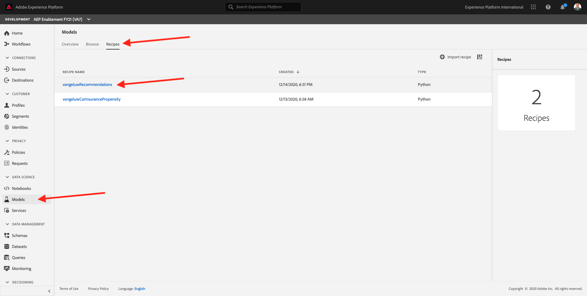

# 8.3 Model Training and Experimentation

So you’ve prepared your data, authored your model and packaged it to test it at scale as a recipe. Now let’s go ahead and train and test the model.

The URL to login to Adobe Experience Platform is: [https://experience.adobe.com/platform](https://experience.adobe.com/platform)

## 8.3.1 - Train a Model based on a Recipe

Log in to [Adobe Experience Platform](https://experience.adobe.com/platform).

After logging in, you'll land on the homepage of Adobe Experience Platform.

Before you continue, you need to select a **sandbox**. The sandbox to select is named ``--aepSandboxId--``. You can do this by clicking the text **[!UICONTROL Production Prod]** in the blue line on top of your screen.

After selecting the appropriate sandbox, you'll see the screen change and now you're in your dedicated sandbox.

From the left menu, click on **Models**.

In this exercise, you'll use recipe that you created in the previous to make product recommendations.
In the top menu, click on **Recipes**.

In Recipes, you'll find multiple recipes. Look for your own recipe in the list, which should be named `ldapRecommendations`.

Click your `ldapRecommendations` recipe to open it.

You now need to create your own Model, based on the `ldapRecommendations` recipe.
To do that, click on the **Create Model** button.

To train this model, you need to provide it with an Input Dataset. In our case, you generated data for this Input Dataset in 1 and the input dataset now contains information around product purchase data.
The dataset to use is called `Demo System - Event Dataset for Recommendations Model Input (Global v1.1)`. Select it from the list.

Click **Next** to continue.

In the next step, you need to define a name for your Model. As a naming convention, let's use: `ldap -  Recommendations Model` and replace **ldap** by your ldap.

Example: for ldap `vangeluw`, the name become `vangeluw - Recommendations Model`.

You can also hyper-tune the Model by changing the Model Configuration. To do that, you can change the number of recommendations and the sampling fraction.

If you want to update the Model's Configuration parameters, double-click one of the parameters and give it a new value.

For instance, I'd like to have 3 recommendations with a sampling fraction of 0.8.

After changing these values, click **Finish** to finish your configuration.

After a couple of seconds, you'll be reverted back to the Model's homepage where you'll see a Training Run 1 with a status of **Pending**. The process to finish the training run can take 5+ minutes.

After 1-2 minutes, your Training Run's status will change to **Running**.

And 1-2 minutes later, the Training Run's status will change to **Complete**.

Once the Training Run has completed, you'll see a couple of metrics that indicate the quality of the run:

* **Recall** is also known as True Positive Rate and also as Sensitivity: if the real result was Yes, how often did the model predict Yes?

* **Precision** means: When the model predicts Yes, how often is it correct?

Training a model requires more then one run. All Training Runs will be visible on this page and you'll be able to compare their results, so you can decide which one is the most successful.

After training your model, let's now score it in the next exercise.

Next Step: [8.4 - Scoring and Consumption of Insights](./ex4.md)

[Go Back to Module 8](./data-science-workspace-popularity-based-recommendations.md)

[Go Back to All Modules](../../overview.md)
