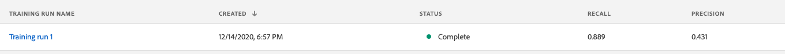

# 8.4 Scoring and Consumption of Insights

Now that we’ve experimented with our recommendations model and have determined the optimal run, we can move on to scoring the model to generate product recommendations.

The URL to login to Adobe Experience Platform is: [https://experience.adobe.com/platform](https://experience.adobe.com/platform)

## 8.4.1 - Score a Model based on a Recipe

After training a model, we can use the model to score and as such, have the model build recommendations which can be activated through targeting.

To start scoring, let's re-open Training Run 1 by clicking it.

After opening Training Run 1, you'll see a full overview of the Training Run.

To score, you have to click the **+ Score** button in the top right corner of your screen.

In the next step, you again have to select an Input Dataset. Let's choose the `Demo System - Event Dataset for Recommendations Model Input (Global v1.1)`.

After selecting the Input Dataset, click **Next**.

In the next step, you need to select a dataset to which Platform will output results. In this case, select the `Demo System - Profile Dataset for ML Predictions (Global v1.1)`.

After selecting the Output Dataset, click **Next**.

In the next screen, you'll see the Model's Configuration parameters.

After updating the Model's Configuration parameters, click **Finish**.

A **Scoring Run** is now created, and has a status of **Pending**.

And 1-2 minutes later, the Scoring Run's status will change to **Complete**.

And finally, let's preview the results. Click on **Scoring Run 1**

Next, click the **Preview Scoring Results Dataset**.

Next Step: [Summary and benefits](./summary.md)

[Go Back to Module 8](./data-science-workspace-popularity-based-recommendations.md)

[Go Back to All Modules](../../overview.md)
