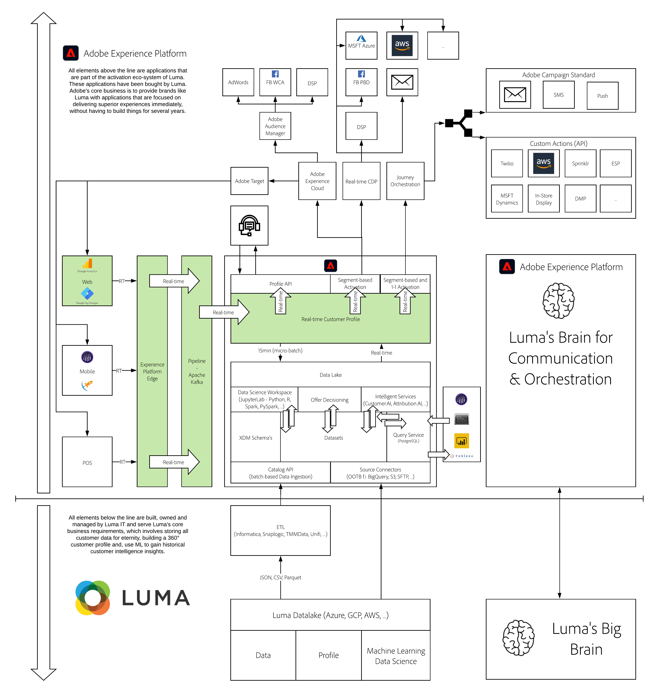

# 9. Data Ingestion using Google Tag Manager and Google Analytics

**Author: [Gerard Lindeboom](https://www.linkedin.com/in/gerardlindeboom/), [Wouter Van Geluwe](https://www.linkedin.com/in/woutervangeluwe/)**

In this module, the following topics will be addressed:
  
- Configuration of Google Tag Manager
- Basic setup of Google Analytics
- Stream GA/GTM-data to Adobe Experience Platform in real-time

In this module, the goal is to install and configure Google Tag Manager and Google Analytics and connect that to Adobe Experience Platform by capturing data from your Platform Demo website client-side and streaming it in real-time to Adobe Experience Platform.
This is to show that brands with an existing Google Analytics and Google Tag Manager implementation can also benefit from the power of Adobe Experience Platform, without limitations or latencies.

## Learning Objectives

- Learn how to create a Google account
- Learn how to set up a Google Tag Manager and Google Analytics property
- Learn how to create variables and triggers in Google Tag Manager
- Learn how to troubleshoot data ingestion into Adobe Experience Platform

## Prerequisites

- Access to Adobe Experience Platform: [https://experience.adobe.com/platform](https://experience.adobe.com/platform)
- Access to Google Tag Manager and Google Analytics

>[!IMPORTANT]
>
>This tutorial was created to facilitate a particular workshop format. It uses specific systems and accounts to which you might not have access. Even without access, we think you can still learn a lot by reading through this very detailed content. If you're a participant in one of the workshops and need your access credentials, please contact your Adobe representative who will provide you with the required information.

## Architecture Overview

Have a look at the below architecture, which highlights the components that will be discussed and used in this module.

## Sandbox to use

For this module, please use this sandbox: `--aepSandboxId--`.

>[!NOTE]
>
>Don't forget to install, configure and use the Chrome Extension as referenced in [0.6 - Install the Chrome extension for the Experience League documentation](../module0/ex6.md)

## Exercises

[9.0 Create a Google Account](./ex0.md)

In this exercise, you'll set up a Google User Account. If you already have a Google User Account, you can skip this step.

[9.1 Create a Google Tag Manager Property](./ex1.md)

In this exercise, you'll set up a Google Tag Manager property. You will use this on the Platform Demo website to manage the Google Analytics code and to send data to platform.

[9.2 Setup Google Analytics & link it to GTM](./ex2.md)

In this exercise, you'll set up a Google Analytics property which will be used on your Platform Demo website.

[9.3 Configure GTM Variables](./ex3.md)

In this exercise, you'll be configuring Data Elements so you can send data to Google Analytics and to Adobe Experience Platform.

[9.4 Retrieve Data Sets in Platform](./ex4.md)

In this exercise, you'll retrieve data sets in Adobe Experience Platform.

[9.5 Configure GTM Tags & Triggers](./ex5.md)

After the configuration of variables in your Google Tag Manager property and retrieving the configuration of your datasets in the Adobe Experience Platform UI, you're now ready to configure your Google Tag Manager Tags to send real data into Adobe Experience Platform.

[9.6 Publish your GTM Property](./ex6.md)

With all GTM configuration done now, let's publish your Google Tag Manager property.

[9.7 Implement GTM Tag on your Platform Demo website](./ex7.md)

After publishing your Google Tag Manager property, you can now implement it on your Platform Demo website.

[9.8 Verify Data Ingestion from website into Platform](./ex8.md)

With the implementation done now, you'll learn how you can verify your full implementation.

[Summary and benefits](./summary.md)

Summary of this module and overview of the benefits.

>[!NOTE]
>
>Thank you for investing your time in learning all there is to know about Adobe Experience Platform. If you have questions, want to share general feedback of have suggestions on future content, please contact Wouter Van Geluwe directly, by sending an email to **vangeluw@adobe.com**.

[Go Back to All Modules](../../overview.md)
