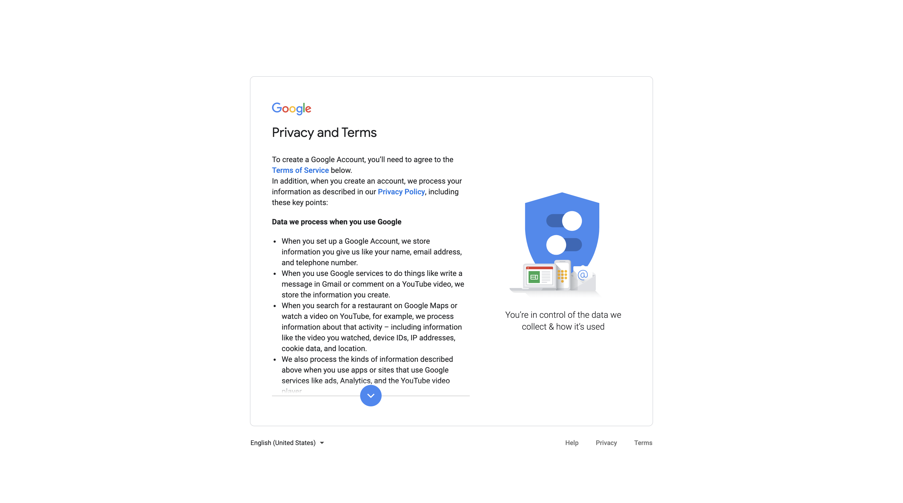

# 9.0 Create a Google Account

Go to [https://accounts.google.com/signup](https://accounts.google.com/signup).

Enter your personal data.

Enter your mobile phone number and birthday.

Click **Verify** to receive a text message.

Enter the code you received from Google to verify your account.

Click **Skip** (unless you want to get more from your number).

Scroll down on the T&C's.

Check the two checkboxes and click **Create Account**.

Click **Confirm**.

You're done - your Google Account has been created.

Next Step: [9.1 Create a Google Tag Manager Property](./ex1.md)

[Go Back to Module 9](./data-ingestion-using-google-tag-manager-and-google-analytics.md)

[Go Back to All Modules](../../overview.md)
