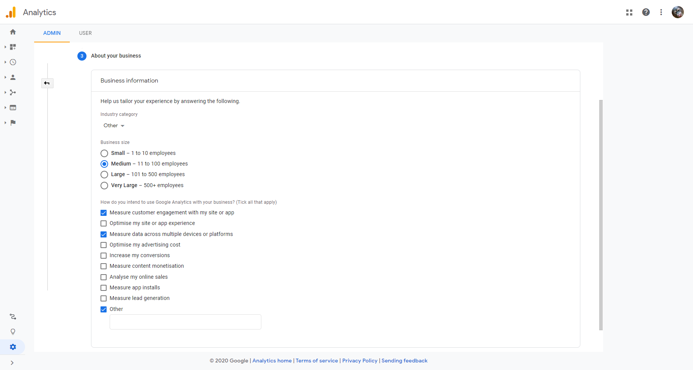
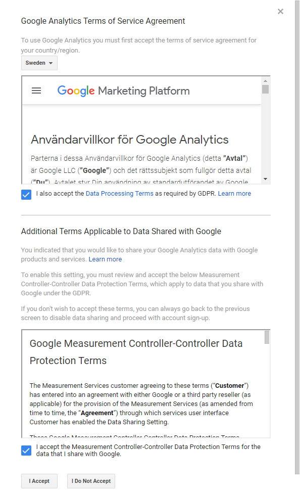
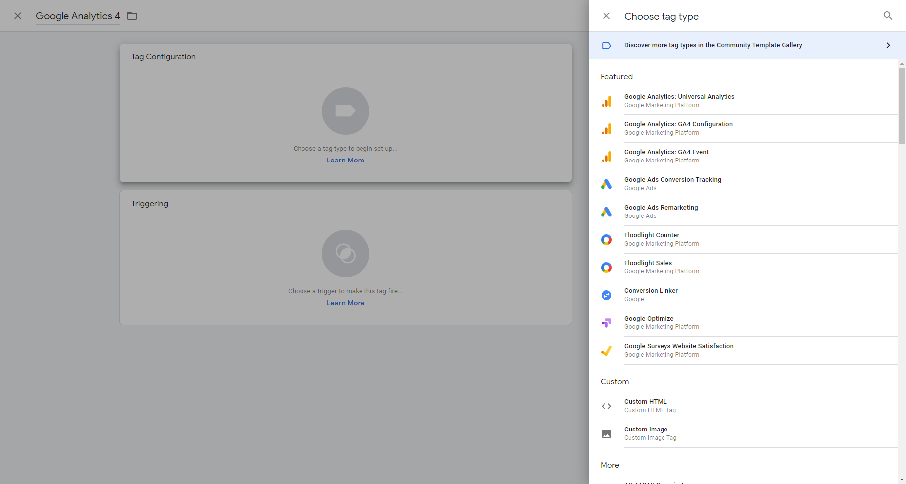

# 9.2 Setup Google Analytics & link it to GTM

Go to [https://analytics.google.com/](https://analytics.google.com/) and login with your Google Account.

If this is the first time you do this, your screen will look like this.

Click on **Start measuring**.

You'll need to fill in some Account details about the website you want to analyze. Please use **Demo System - ldap**, and leave the fields checked, unless you have a specific reason to uncheck them.

Click **Next** to proceed to **Property setup**.

Give your property a name. Please use **Demo System - ldap**.  If you wish you can change the timezone and currency to reflect where you are based.

Click **Next** to proceed to **About your business**.

Select anything you wish in this page.

Click **Create**.

The Google Analytics Terms of Service Agreement pops up.  Select the country where you are based. 

Accept the terms by clicking the checkboxes and clicking **I accept**.

You are now brought to the **Data Streams** section within **Admin**. This is where you can detail what you want to measure.

Select **Web**.

Provide the website URL of **www.aepdemo.net**, and the Steam Name of **Demo System - ldap**.

Click **Create stream**.

You'll now see the details of the data stream you have just created.

You need to copy the **Measurement ID**. This value can be used by Google Tag Manager to manage the Google Analytics tags.

So let's go back to GTM to store the Measurement ID there.

Go to [https://tagmanager.google.com/](https://tagmanager.google.com/) by following the URL or by clicking the **Product Switcher** item at the top right of the screen.

Next choose Tag Manager at the bottom of the list.

You might need to login again, then choose the container in GTM for **www.aepdemo.net**.

You are now on the overview page of GTM where nothing has been added yet.

If you're familiar to Adobe Launch you use **Extensions**, **Data elements** and **Rules**. In GTM you use in more or less the same way **Tags**, **Variables** and **Triggers**.
We're going to create a **Tag** for Google Analytics, then a **Trigger** when to fire the Google Analytics tag.

Create the tag by clicking **New Tag**.

You'll then see this screen:

Give this tag a name by changing **Untitled Tag** into **Universal Analytics**:

| Form field                | Value               |
|:-------------------------------------------| :------------------ |
|Tag Name|Google Analytics 4|

Then press **Tag Configuration**, where you can choose from a list of available tags.

Choose **Google Analytics: GA4 Configuration**. You'll then see this screen:

This selection gives you a next screen where you can enter as a Measurement ID the one you copied earlier from Google Analytics.

You now need to choose at least one trigger which tells GTM where this tag will fire. Later we will add additional triggers. But for now we will tell it to fire on each page view. Click the **Triggering** element in your screen.

You will see the following screen with one trigger that you can choose called **All Pages**. Later we will define new triggers for specific pages. 

Click **All Pages**.

You are brought back to the main screen with your tag configuration displayed.

Click **Save** to proceed.

You are now again on the overview page, but here you see that there is one change to be published in the workflow.

Click **Submit**.

First you see this screen where you can fill in descriptive information about the change you're going to publish. Add a short description and a more describing one.

Now click **Publish**.

You're then seeing the versions tab in GTM, showing you the summary of what you just published. This will not be active yet, since we have not yet implemented the GTM tag on the Platform Demo website. We'll be doing that in a later exercise.

From here you can click back to the **Workspace** tab, where you can add more Tags, Triggers and Variables, which we'll be doing in the next Exercise.

Next Step: [9.3 Configure GTM Variables](./ex3.md)

[Go Back to Module 9](./data-ingestion-using-google-tag-manager-and-google-analytics.md)

[Go Back to All Modules](../../overview.md)
