# 9.4 Retrieve Datasets in Platform

As part of the Google Tag Manager Rule configuration, we'll define rules that will send behavioral and profile data to Platform. When defining a tag and trigger in Google Tag Manager to send behavioral and/or profile data to Adobe Experience Platform, we'll need to define some variables in Google Tag Manager:

* `Adobe Organization ID/IMS Org ID`
* `DCS Streaming Endpoint`
* `Profile Dataset ID` & `Profile Schema Reference`
* `Experience Event Dataset ID` & `Experience Event Schema Reference`

We'll go into Platform to retrieve most of that information, to then fill out the below table and configure it in Google Tag Manager.

| Name | GTM Variable Name | Constant Value |
| ------------- | ------------- | ------------- |
| Adobe Organization ID | imsOrgId |`--aepImsOrgId--`|
| DCS Streaming Endpoint | dcsStreamingEndpoint | `--dcsInletId--` |
| Profile Dataset ID | profileDatasetId |  |
| Profile Schema Reference | profileSchemaRef |  |
| Experience Event Dataset ID | eeDatasetId |  |
| Experience Event Schema Reference | eeSchemaRef |  |

Log in to [Adobe Experience Platform](https://experience.adobe.com/platform).

After logging in, you'll land on the homepage of Adobe Experience Platform.

Before you continue, you need to select a **sandbox**. The sandbox to select is named ``--aepSandboxId--``. You can do this by clicking the text **[!UICONTROL Production Prod]** in the blue line on top of your screen.

After selecting the appropriate sandbox, you'll see the screen change and now you're in your dedicated sandbox.

A dataset needs to be mapped against a schema. Schema's are defined as part of our Experience Data Model, aka XDM.

Behavioral data needs to be mapped against the ExperienceEvent schema.

Profile data needs to be mapped against the Profile XDM schema.

You can consult these schema's by going to **Schemas** in the Platform menu.

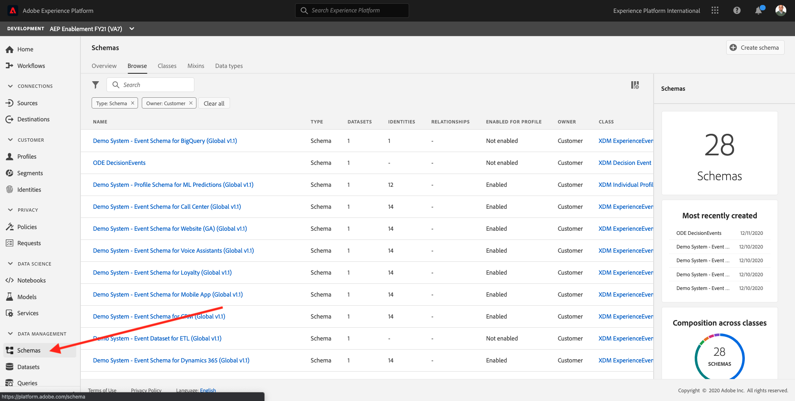

If you'd like to know more about XDM, please have a look here:

* [https://www.adobe.io/open/standards/xdm.html](https://www.adobe.io/open/standards/xdm.html)
* [https://github.com/adobe/xdm](https://github.com/adobe/xdm)

Search for `Demo System - Profile Schema for Website (GA) (Global v1.1)` to find the Profile XDM for your Platform Org.

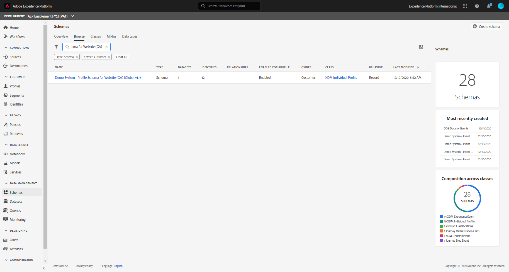

The `Demo System - Profile Schema for Website (GA) (Global v1.1)` looks like this and is using the Google ID as a Secondary Identifier, with Email being the Primary Identifier.

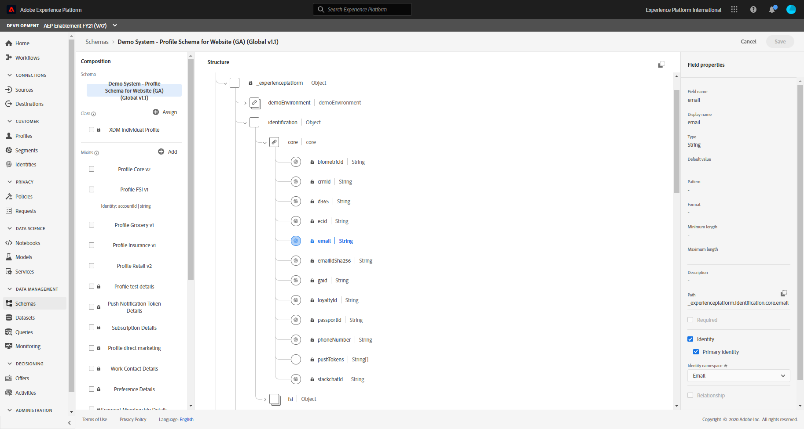

Search for `Demo System - Event Schema for Website (GA) (Global v1.1)` to find the ExperienceEvent XDM.

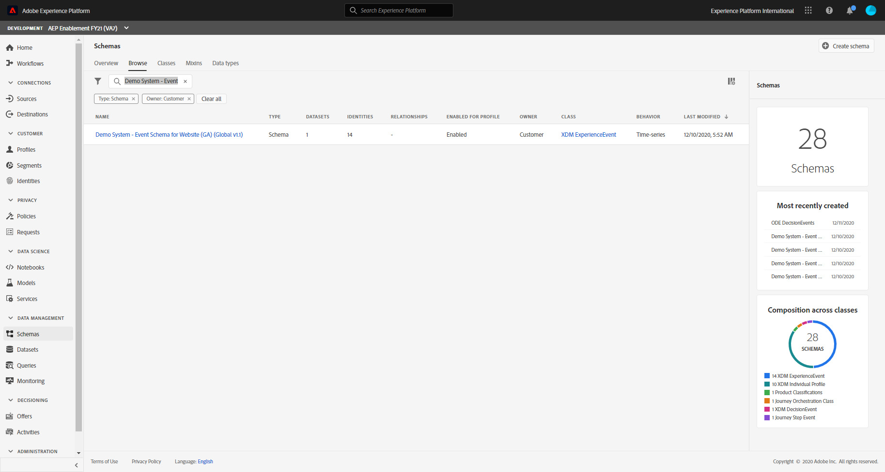

The `Demo System - Event Schema for Website (GA) (Global v1.1)` looks like this and is using the Google ID (GAID) as the Primary Identifier.

Try to locate these two Schemas yourself in the UI of Platform.

To view **Datasets**, navigate to the **Datasets** menu option.

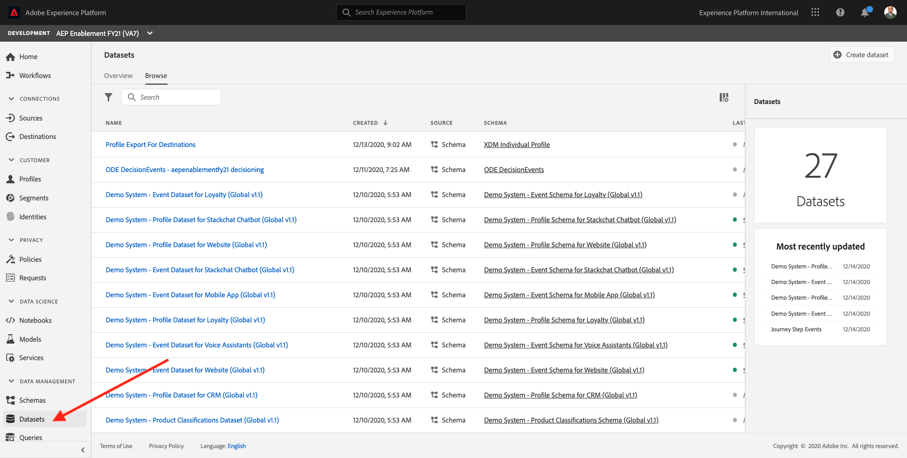

You'll find a number of existing Datasets in Platform.

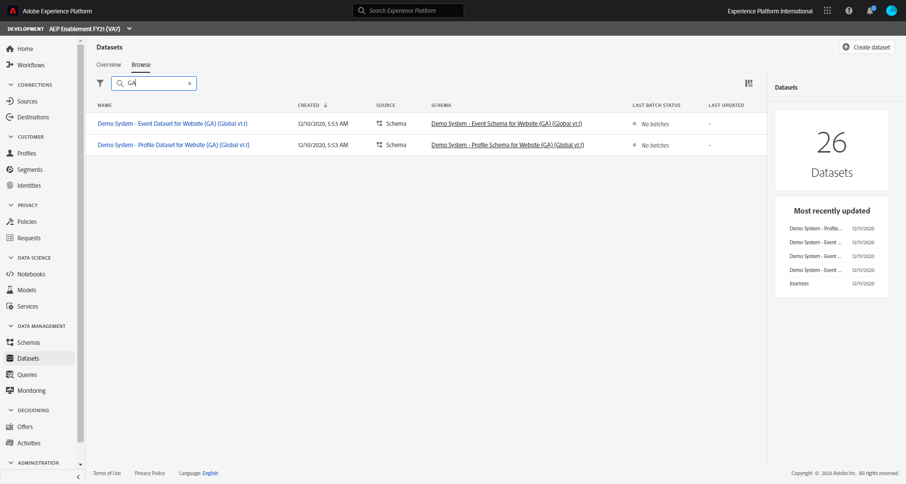

At this moment, we'll use two datasets, which are linked to the Schema's that you just viewed

* 1 Dataset to capture Google Analytics Website Interaction data
* 1 Dataset to capture Google Analytics Website Registration data

These datasets already exist! Don't recreate them.

* Website Interaction Dataset name:

  * **Demo System - Event Dataset for Website (GA) (Global v1.1)**
    

* Website Registration name:

  * **Demo System - Profile Dataset for Website (GA) (Global v1.1)**
    

After having consulted the above Schemas and Datasets, you can now fill out the below table:

| Name | GTM Variable Name | Constant Value |
| ------------- | ------------- | ------------- |
| Adobe Organization ID | imsOrgId |`--aepImsOrgId--`|
| DCS Streaming Endpoint | dcsStreamingEndpoint |`--dcsInletId--`|
| Profile Dataset ID | profileDatasetId | Your Profile Dataset ID |
| Profile Schema Reference | profileSchemaRef |https://ns.adobe.com/`--aepTenantIdSchema--`/schemas/...|
| Experience Event Dataset ID | eeDatasetId | Your Experience Event Dataset ID |
| Experience Event Schema Reference | eeSchemaRef |https://ns.adobe.com/`--aepTenantIdSchema--`/schemas/...|

>[!NOTE]
>
> The above values for Dataset IDs and Schema Reference IDs are specific to the Adobe Experience Platform instance that was used to build this documentation. Please retrieve your own Dataset IDs and Schema Ref IDs as indicated.

Go to [https://tagmanager.google.com/](https://tagmanager.google.com/) and login with your personal login details.

Go to **Variables**.

In the **User-Defined Variables** - section, click **New**.

First, we'll configure the Variable for `Adobe Organization ID`.

* Rename `Untitled Variable` to ``imsOrgId``
* Click on **Variable Configuration** and choose **Utilities - Constant** as Variable Type

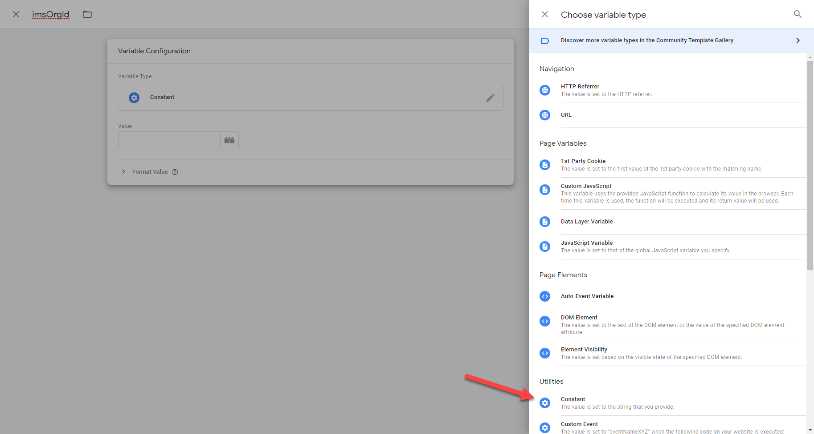

* Enter the constant value for `Adobe Organization ID` out of the above table as this variable.

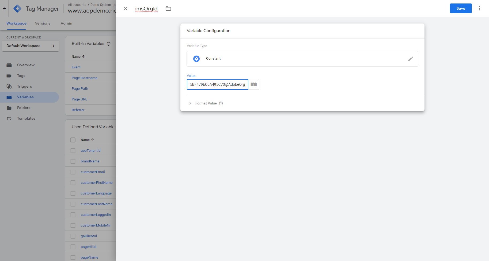

* Click **Save** to save your variable.

Next, we'll configure the variable for `DCS Streaming Endpoint`.

* Rename `Untitled Variable` to `dcsStreamingEndpoint`
* Click on **Variable Configuration** and choose **Utilities - Constant** as Variable Type
* Enter the constant value for `DCS Streaming Endpoint`  out of the above table for this Variable.

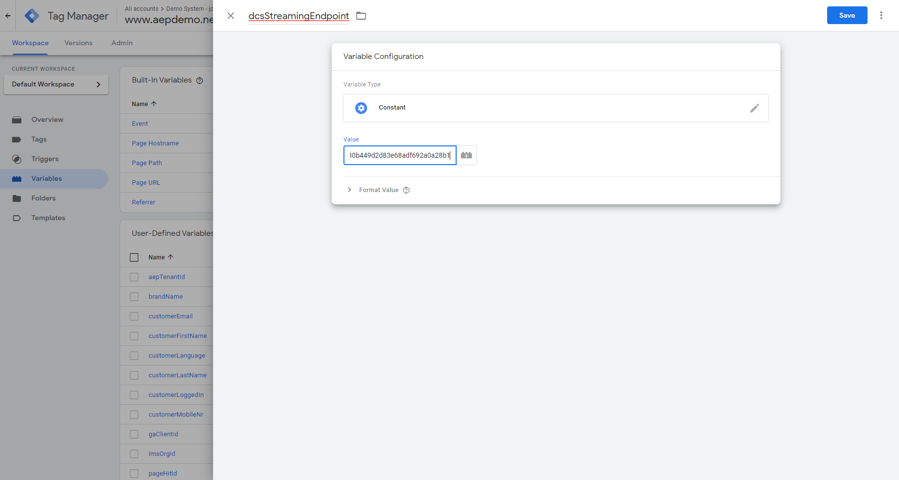

* Click **Save** to save your variable.

Next, we'll configure the variable for `Profile Dataset ID`.

* Rename `Untitled Variable` to `profileDatasetId`
* Click on **Variable Configuration** and choose **Utilities - Constant** as Variable Type
* Enter the constant value for `Profile Dataset ID`  out of the above table for this variable.

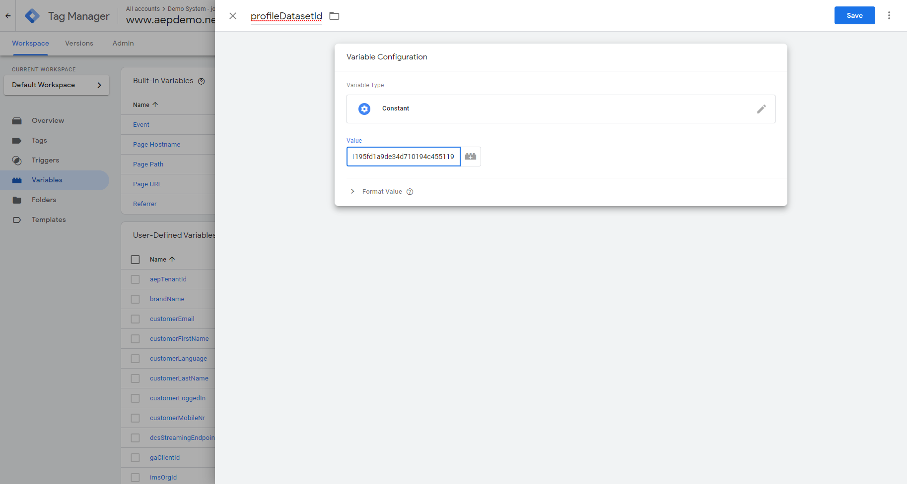

* Click **Save** to save your variable.

Next, we'll configure the variable for `Profile Schema Reference`.

* Rename `Untitled Variable` to `profileSchemaRef`
* Click on **Variable Configuration** and choose **Utilities - Constant** as Variable Type
* Enter the constant value for `Profile Schema Reference` out of the above table for this variable.

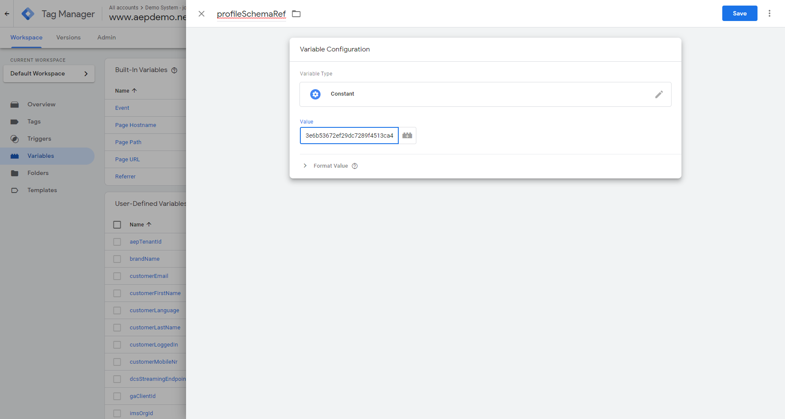

* Click **Save** to save your variable.

Next, we'll configure the Variable for `Experience Event Dataset ID`.

* Rename `Untitled Variable` to `eeDatasetId`
* Click on **Variable Configuration** and choose `Utilities - Constant` as Variable Type
* Enter the constant value for **Experience Event Dataset ID** out of the above table for this Variable.

* Click **Save** to save your variable.

Finally, we'll configure the variable for `Experience Event Schema Reference`.

* Rename `Untitled Variable` to `eeSchemaRef`
* Click on **Variable Configuration** and choose **Utilities - Constant** as Variable Type
* Enter the constant value `Experience Event Schema Reference` out of the above table for this variable.

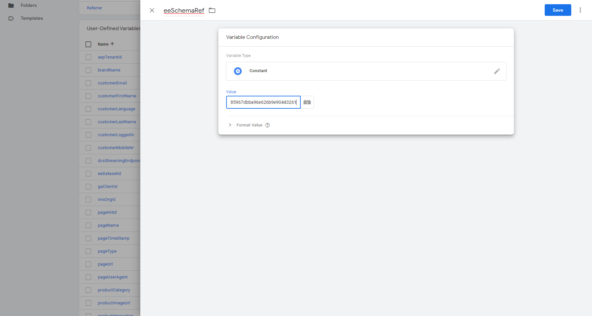

* Click **Save** to save your Variable.

Congratulations for reaching this point! Let's continue with the Google Tag Manager Tags and Triggers Configuration now.

Next Step: [9.5 Configure Google Tag Manager Tags & Triggers](./ex5.md)

[Go Back to Module 9](./data-ingestion-using-google-tag-manager-and-google-analytics.md)

[Go Back to All Modules](../../overview.md)
