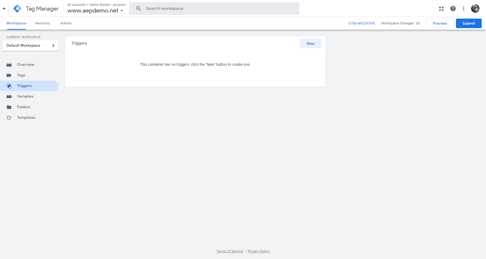
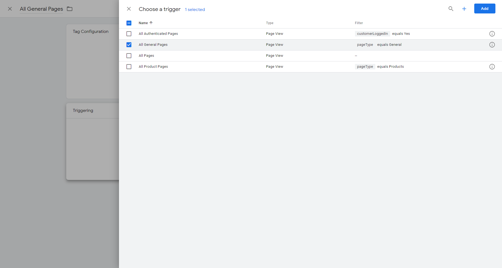
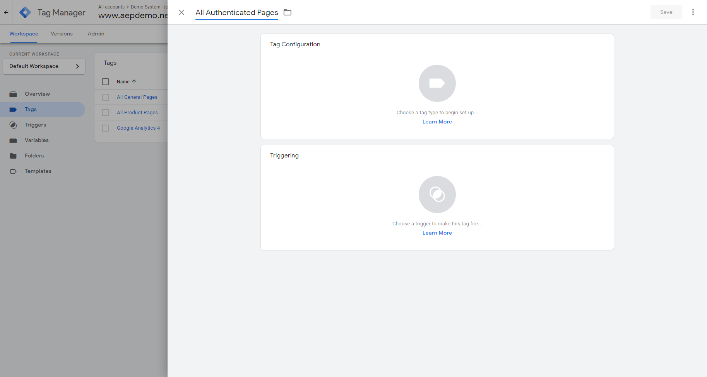

# 9.5 Configure Google Tag Manager Tags & Triggers

After creating the extensions and data elements, it's time to build our rules or "triggers" as they are called in Google Tag Manager.

Go to [https://tagmanager.google.com/](https://tagmanager.google.com/) and login with your personal login details.

## 9.5.1 - Configure Trigger: All General Pages

In the Google Tag Manager menu, go to **Triggers**.



Click on **New**.


Our first trigger will fire on All General Pages.
As a name for this trigger, let's use `All General Pages`.


We need to configure a trigger this rule, so let's click on the **Trigger Configuration**.


This trigger should be activated on certain Page Views, so let's select **Page View**.


Then select **Some Page Views** and specify that the trigger should be fired when **pageType** equals `General`.


Click **Save** to save your trigger.


## 9.5.2 - Configure Trigger: All Product Pages

In **Triggers**, click **New**.


Our second trigger will fire on All Product Pages.
As a name for this trigger, let's use `All Product Pages`.


We need to configure a trigger this rule, so let's click on the **Trigger Configuration**.


This trigger should be activated on certain Page Views, so let's select **Page View**.


Then select **Some Page Views** and specify that the trigger should be fired when **pageType** equals `Products`


Click **Save** to save your trigger.


## 9.5.3 - Configure Trigger: All Authenticated Pages

In **Triggers**, click **New**.


Our third trigger will fire on All Authenticated Pages.
As a name for this trigger, let's use `All Authenticated Pages`.


We need to configure a trigger this rule, so let's click on the **Trigger Configuration**.


This trigger should be activated on certain Page Views, so let's select **Page View**.


Then select **Some Page Views** and specify that the trigger should be fired when **customerLoggedIn** equals `Yes`.


Click **Save** to save your trigger.


With this, you've successfully finished the setup of your Triggers in Google Tag Manager.

Let's now configure the **Tags** to send to Adobe Experience Platform and link the **Triggers** that you just built to those Tags.

## 9.5.4 - Configure Tag: All General Pages

In the Google Tag Manager menu, go to **Tags**.


Click on **New**.


Our first tag will fire on All General Pages.
As a name for this tag, let's use `All General Pages`.


Click on **Triggering** to link the you created to this tag.


Choose your `All General Pages` - trigger.



Click **Add** to add your trigger to this tag.


Next, click on **Tag Configuration**.


In the menu, select **Custom HTML**.


Paste this code in the Tag:

```javascript
<script>console.log(">>>>>GA - All General Pages - Sending Page View to DCS");fetch("{{dcsStreamingEndpoint}}",{"credentials":"omit","headers":{"accept":"*/*","accept-language":"en-US,es;q=0.9,en;q=0.8","cache-control":"no-cache","content-type":"application/json","pragma":"no-cache","sec-fetch-mode":"cors","sec-fetch-site":"cross-site"},"referrer":"{{pageUrl}}","referrerPolicy":"no-referrer-when-downgrade","body":"{\"header\":{\"datasetId\":\"{{eeDatasetId}}\",\"imsOrgId\":\"{{imsOrgId}}\",\"source\":{\"name\":\"GA\"},\"schemaRef\":{\"id\":\"{{eeSchemaRef}}\",\"contentType\":\"application/vnd.adobe.xed-full+json;version=1\"}},\"body\":{\"xdmMeta\":{\"schemaRef\":{\"id\":\"{{eeSchemaRef}}\",\"contentType\":\"application/vnd.adobe.xed-full+json;version=1\"}},\"xdmEntity\":{\"_id\":\"{{pageHitId}}\",\"eventType\":\"GTM_pageView\",\"web\":{\"webPageDetails\":{\"name\":\"{{pageName}}\",\"pageViews\":{\"value\":1}}},\"timestamp\":\"{{pageTimeStamp}}\",\"environment\":{\"browserDetails\":{\"userAgent\":\"{{pageUserAgent}}\",\"acceptLanguage\":\"{{customerLanguage}}\"}},\"{{aepTenantId}}\":{\"demoEnvironment\":{\"brandName\":\"{{brandName}}\",\"tms\":\"GTM\"},\"identification\":{\"core\":{\"gaid\":\"{{gaClientId}}\"}}}}}}","method":"POST","mode":"cors"});</script>
```


Your configuration should now look like this:


Click **Save** to save your tag.


## 9.5.5 - Configure Tag: All Product Pages

In the Google Tag Manager menu, go to **Tags**.


Click on **New**.


Our first tag will fire on All Product Pages.
As a name for this tag, let's use `All Product Pages`.


Click on **Triggering** to link the you created to this tag.


Choose your `All Product Pages` trigger.


Click **Add** to add your trigger to this tag.


Next, click on **Tag Configuration**.


In the menu, select **Custom HTML**.

Paste this code in the Tag:

```javascript
<script>
console.log(">>>>> GA - All Product Pages - Sending Product View to DCS");
  
fetch("{{dcsStreamingEndpoint}}", {"credentials":"omit","headers":{"accept":"*/*","accept-language":"en,nl;q=0.9,en-US;q=0.8,en-GB;q=0.7,sv;q=0.6,it;q=0.5,fr;q=0.4,es;q=0.3,da;q=0.2,de;q=0.1","content-type":"application/json","sec-fetch-mode":"cors","sec-fetch-site":"cross-site"},"referrer":"{{pageUrl}}","referrerPolicy":"no-referrer-when-downgrade","body":"{\"header\":{\"datasetId\":\"{{eeDatasetId}}\",\"imsOrgId\":\"{{imsOrgId}}\",\"source\":{\"name\":\"GTM\"},\"schemaRef\":{\"id\":\"{{eeSchemaRef}}\",\"contentType\":\"application/vnd.adobe.xed-full+json;version=1\"}},\"body\":{\"xdmMeta\":{\"schemaRef\":{\"id\":\"{{eeSchemaRef}}\",\"contentType\":\"application/vnd.adobe.xed-full+json;version=1\"}},\"xdmEntity\":{\"_id\":\"{{pageHitId}}\",\"eventType\":\"GTM_productView\",\"web\":{\"webPageDetails\":{\"name\":\"{{pageName}}\"}},\"commerce\":{\"productViews\":{\"value\":1}},\"timestamp\":\"{{pageTimeStamp}}\",\"environment\":{\"browserDetails\":{\"userAgent\":\"{{pageUserAgent}}\",\"acceptLanguage\":\"{{customerLanguage}}\"}},\"identityMap\":{\"GOOGLE\":[{\"id\":\"{{gaClientId}}\"}]},\"productListItems\":[{\"SKU\":\"{{productName}}\",\"priceTotal\":{{productPrice}},\"quantity\":1,\"name\":\"{{productName}}\",\"product\":\"{{productImageUrl}}\",\"productAddMethod\":\"Desktop\",\"{{aepTenantId}}\":{\"core\":{\"imageURL\":\"{{productImageUrl}}\"}}}],\"{{aepTenantId}}\":{\"demoEnvironment\":{\"brandName\":\"{{brandName}}\",\"tms\":\"GTM\"},\"identification\":{\"core\":{\"gaid\":\"{{gaClientId}}\"}}}}}}","method":"POST","mode":"cors"});
</script>
```

Your configuration should now look like this:


Click **Save** to save your tag.


## 9.5.6 - Configure Tag: All Authenticated Pages

In the Google Tag Manager menu, go to **Tags**.


Click on **New**.


Our first tag will fire on All Authenticated Pages.
As a name for this tag, let's use `All Authenticated Pages`.



Click on **Triggering** to link the you created to this tag.


Choose your `All Authenticated Pages` trigger.


Click **Add** to add your trigger to this tag.


Next, click on **Tag Configuration**.


In the menu, select **Custom HTML**.


Paste this code in the Tag:

```javascript
<script>
console.log(">>>>> GA - All Authenticated Pages - Sending PageView to DCS");
  
fetch("{{dcsStreamingEndpoint}}", {"credentials":"omit","headers":{"accept":"*/*","accept-language":"en,nl;q=0.9,en-US;q=0.8,en-GB;q=0.7,sv;q=0.6,it;q=0.5,fr;q=0.4,es;q=0.3,da;q=0.2,de;q=0.1","content-type":"application/json","sec-fetch-mode":"cors","sec-fetch-site":"cross-site"},"referrer":"{{pageUrl}}","referrerPolicy":"no-referrer-when-downgrade","body":"{\"header\":{\"datasetId\":\"{{profileDatasetId}}\",\"imsOrgId\":\"{{imsOrgId}}\",\"source\":{\"name\":\"GA\"},\"schemaRef\":{\"id\":\"{{profileSchemaRef}}\",\"contentType\":\"application/vnd.adobe.xed-full+json;version=1\"}},\"body\":{\"xdmMeta\":{\"schemaRef\":{\"id\":\"{{profileSchemaRef}}\",\"contentType\":\"application/vnd.adobe.xed-full+json;version=1\"}},\"xdmEntity\":{\"_id\":\"{{pageHitId}}\",\"_repo\":{\"createDate\":\"{{pageTimeStamp}}\"},\"person\":{\"name\":{\"lastName\":\"{{customerLastName}}\",\"firstName\":\"{{customerFirstName}}\"}},\"{{aepTenantId}}\":{\"identification\":{\"core\":{\"gaid\":\"{{gaClientId}}\",\"email\":\"{{customerEmail}}\",\"phoneNumber\":\"{{customerMobileNr}}\"}}}}}}","method":"POST","mode":"cors"});
</script>
```

Your configuration should now look like this:


Click **Save** to save your tag.


You can now publish you configuration in the next exercise.

Next Step: [9.6 Publish Google Tag Manager Property](./ex6.md)

[Go Back to Module 9](./data-ingestion-using-google-tag-manager-and-google-analytics.md)

[Go Back to All Modules](../../overview.md)
