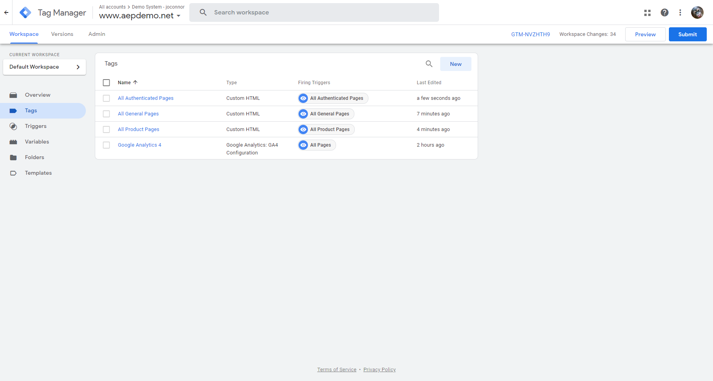

# 9.6 Publish your Google Tag Manager Property

Go to [https://tagmanager.google.com/](https://tagmanager.google.com/) and login with your personal login details.

In the Google Tag Manager UI, in the menu option **Workspace** > **Tags**, you should now see four tags. You now need to publish them.

To start the publishing process, click the **Submit** button.

Next, click the **Publish** button.

Click **Continue** on the next screen.

You'll then see this screen while your changes are being published.

Finally, you'll see a confirmation of your publication.

Your Google Tag Manager Property is now published. The last thing to do now is to setup the Google Tag Manager Tags on the Platform Demo website so that the Google Tag Manager configuration is being loaded.

Next Step: [9.7 Implement Google Tag Manager Tag on Platform Demo website](./ex7.md)

[Go Back to Module 9](./data-ingestion-using-google-tag-manager-and-google-analytics.md)

[Go Back to All Modules](../../overview.md)
