# 9.8 Verify Data Ingestion from website into Platform

Open a new, clean incognito window and navigate to [https://public.aepdemo.net](https://public.aepdemo.net). Enter your Configuration ID and save it.

After updating the configuration of your Configuration ID and loading the AEP Demo website in a new, clean incognito browser window, you should start to see requests being sent towards Adobe Experience Platform.

These requests are sent to the DCS Endpoint that you configured in Exercise 9.4.

To verify if requests are being sent, open your website by going to [https://public.aepdemo.net/index.html](https://public.aepdemo.net/index.html) in Chrome and at the same time open the Chrome Developer Tools.

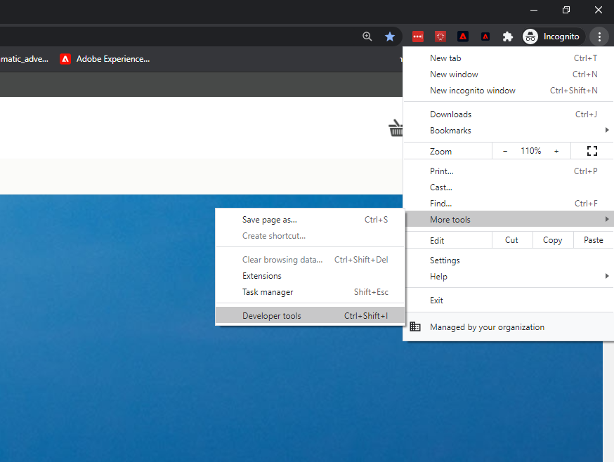

Open the Chrome Developer Tools on the **Network** view and then refresh your page.

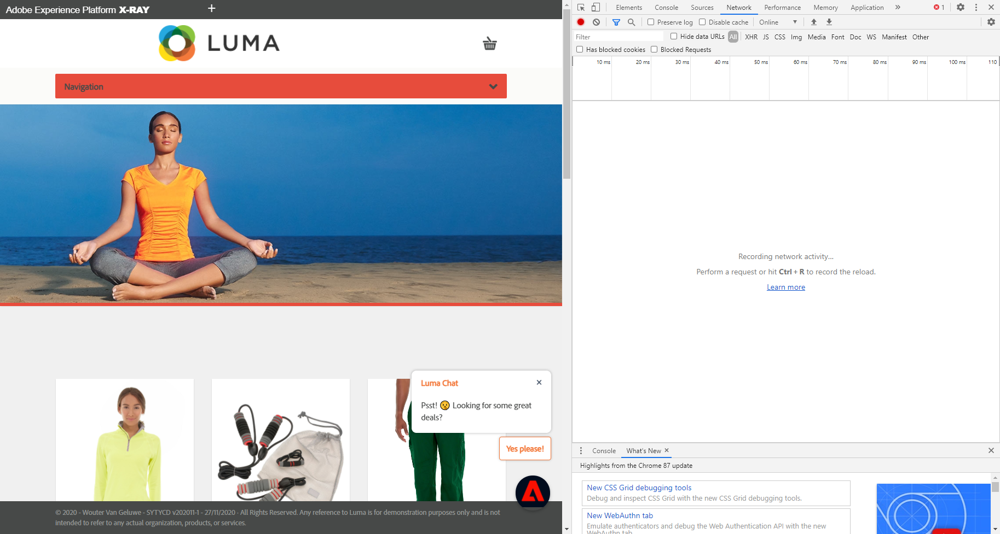

By refreshing your page, you'll see all the requests being sent from the page to various servers, including the requests to the DCS Endpoint of Platform.

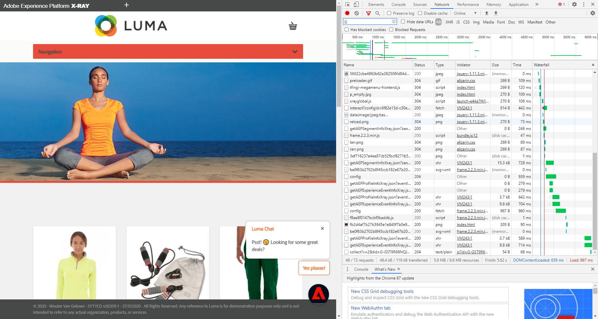

Go to the **Console** view.

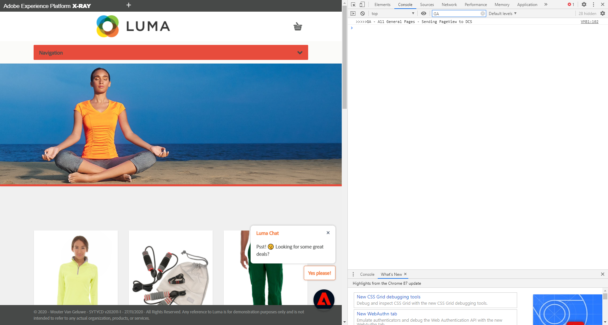

In the **Filter**, type `GA`.

You should now see a log entry that says `>>>>> GA - All General Pages - Sending PageView to DCS`. This indicates that the request from your Google Tag Manager tag `All General Pages` has fired.

Go back to the **Network** view.

To easily find the requests to Platform, you can apply a filter by entering `dcs` in the Filter field.

This should give you a request to Platform, which is the request that sends in ExperienceEvent data on every page load, now sent by Adobe Experience Platform Launch and also, Google Tag Manager.

The request is the request sent by Google Tag Manager. Click on it and scroll down until you see **Request Payload**.

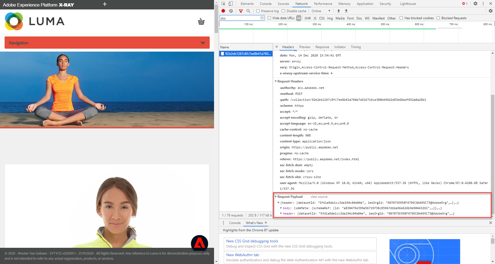

Click on **view source** to view the full raw request to Platform. Select the full raw text and copy it.

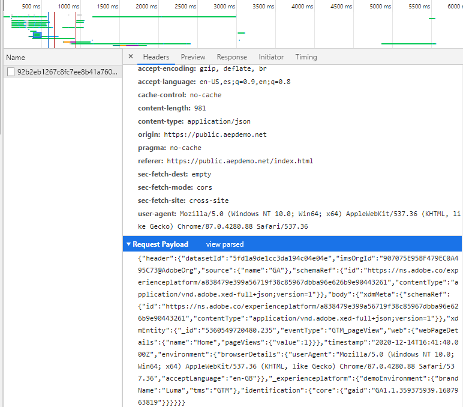

Go to [https://jsonformatter.org/json-pretty-print](https://jsonformatter.org/json-pretty-print) and paste the copied raw text in the left window.

Click on **Make Pretty** to see a readable version of the request to Platform. You now see the full payload as sent by Google Tag Manager to Adobe Experience Platform, and you can also see that the only identifier on this request, the Primary Identifier, is the Google `GAID`. This also means that with Platform, the presence of the ECID isn't a hard requirement anymore. Any identifier, including non-Adobe identifiers, can be the Primary Identifier, it's up to the customer to choose.

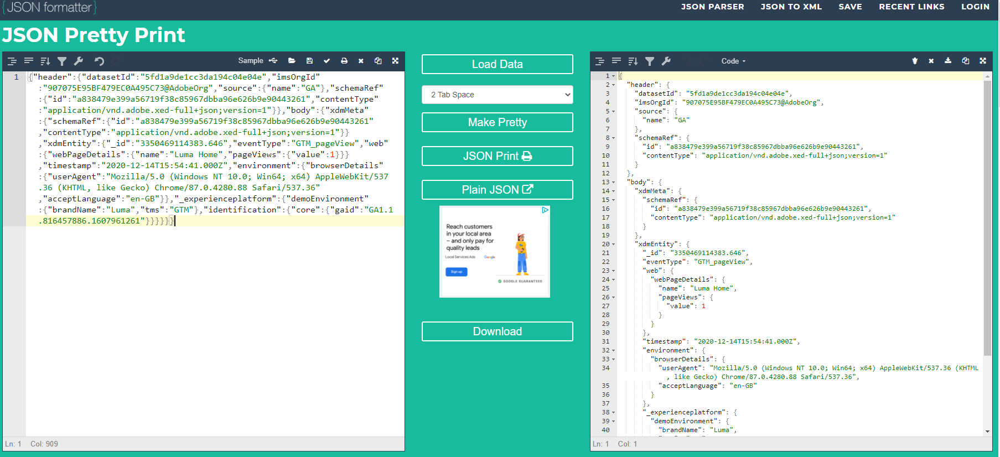

Next, click on any Product like the **Nadia Elements Shell**. Keep the Chrome Developer Console open.

Go to the **Console** view. In the **Filter**, type `GA`.

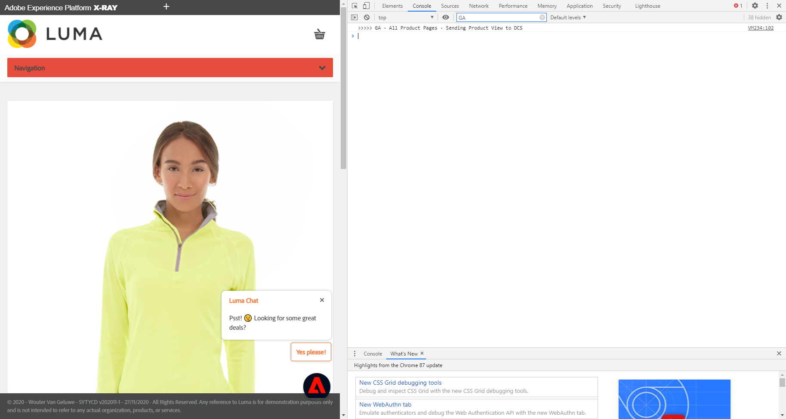

You should now see a log entry that says `>>>>> GA - All Product Pages - Sending PageView to DCS`. This indicates that the request from your Google Tag Manager Tag `All Product Pages` has fired.

Go back to the **Network** view. To easily find the requests to Platform, you can apply a filter by entering `dcs` in the Filter field.

This should give you a request to Platform, which is the request that sends in ExperienceEvent-data for a Product View, now sent by Adobe Experience Platform Launch and also, Google Tag Manager.

The request you see is the request sent by Google Tag Manager. Click on it and scroll down until you see **Request Payload**.

Click on **view source** to view the full raw request to Platform. Select the full raw text and copy it.

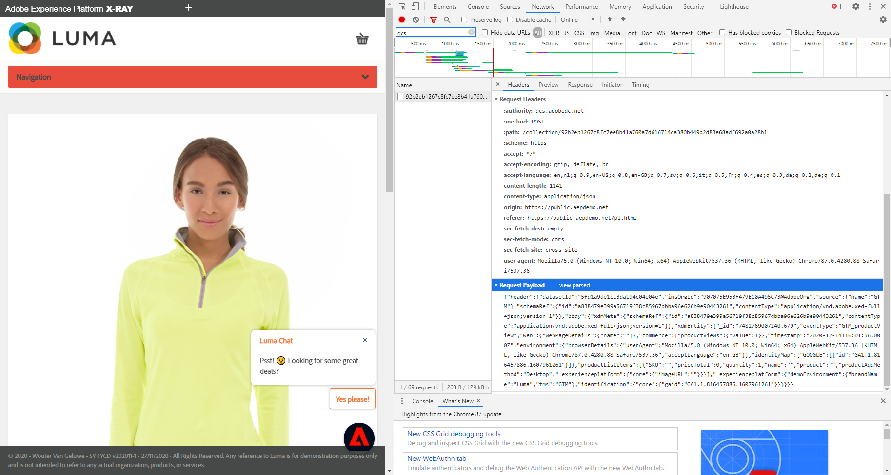

Go to [https://jsonformatter.org/json-pretty-print](https://jsonformatter.org/json-pretty-print) and paste the copied raw text in the left window.

Click on **Make Pretty** to see a readable version of the request to Platform. You now see the full Product Page  payload as sent by Google Tag Manager to Adobe Experience Platform, and you can also see that the only identifier on this request, the Primary Identifier, is the Google `GAID`. This also means that with Platform, the presence of the ECID isn't a hard requirement anymore. Any identifier, including non-Adobe identifiers, can be the Primary Identifier, it's up to the customer to choose.

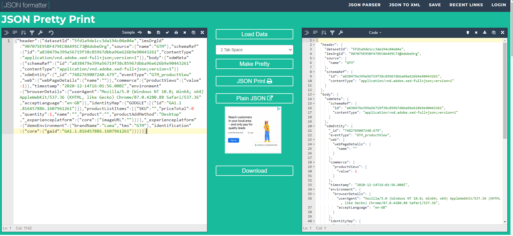

Next, go to to the Login/Register-page [https://public.aepdemo.net/login-register.html](https://public.aepdemo.net/login-register.html).

Fill out all the fields and click **Create Account**.

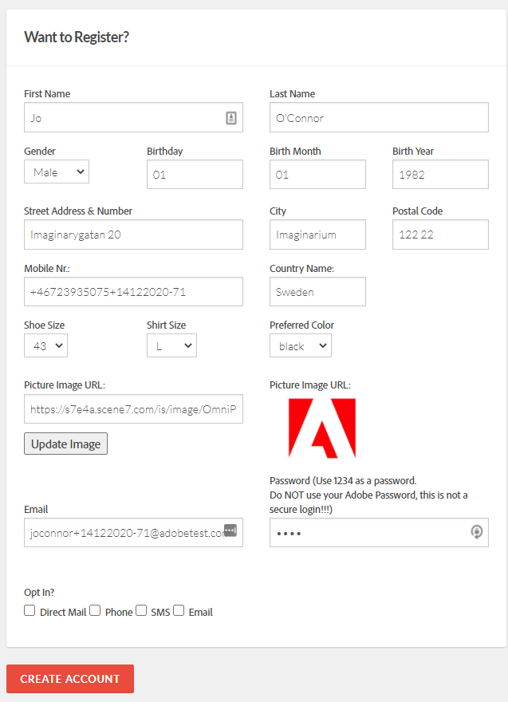

After clicking the **Create Account** button, you're sent to the homepage.

In the Chrome Developer Console, go to the **Console** view. In the **Filter**, type `GA`.

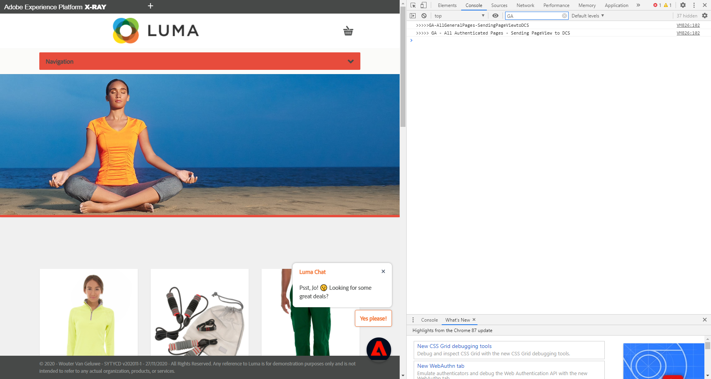

You should now see a log entry that says `>>>>> GA - All General Pages - Sending PageView to DCS` and also another log entry that says `>>>>> GA - All Authenticated Pages - Sending PageView to DCS`. This indicates that the request from your Google Tag Manager Tag `All General Pages` and the GTL Tag for `All Authenticated Pages` has fired.

Go back to the **Network** view. To easily find the requests to Platform, you can apply a filter by entering `dcs` in the Filter field.

This should give you two requests to Platform, which are a request that sends in ExperienceEvent-data for a General Page View and a request that sends in Profile-data, now sent by Adobe Experience Platform Launch and also, Google Tag Manager.

The 2nd request is the request sent by Google Tag Manager containing Profile Data. Click on it and scroll down until you see **Request Payload**.

Click on **view source** to view the full raw request to Platform. Select the full raw text and copy it.

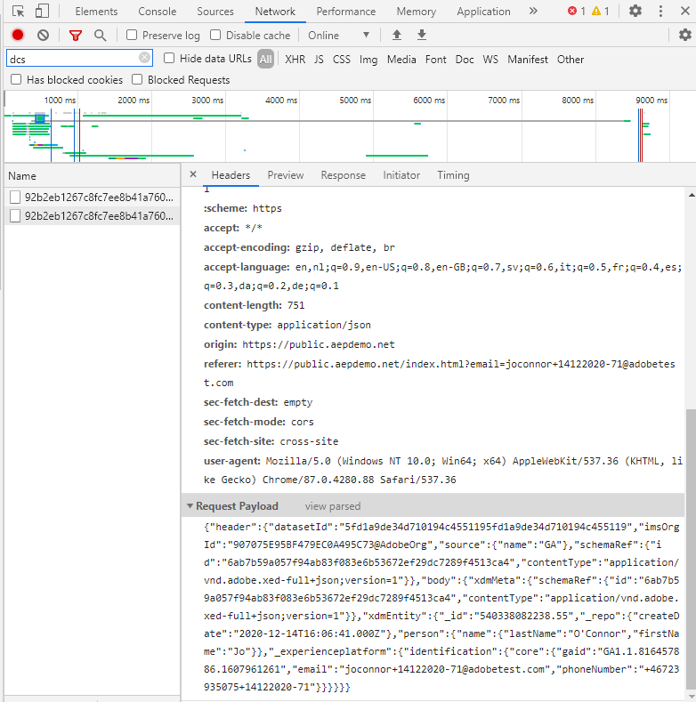

Go to [https://jsonformatter.org/json-pretty-print](https://jsonformatter.org/json-pretty-print) and paste the copied raw text in the left window, then click on **Make Pretty** to see the full payload in a readable format.

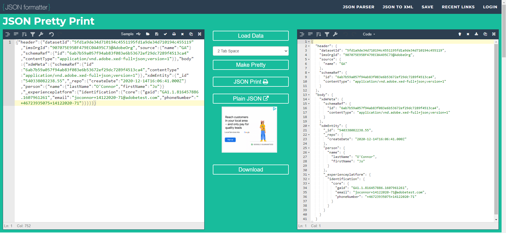

Again you notice that the identifiers-object contains a Google `GAID`. In this case, for Profile data, the Primary Identifier is `emailId`, with `GAID` being a secondary identifier. By having both of these identities on the same request, including the `mobilenr`, ID-syncs have now been done and have connected these 3 identities to each other in Adobe Experience Platform's Unified Identity Service.

If you see all these requests going out to the DCS Endpoint from GTM, that means that GTM is correctly configured.

Now we need to verify whether these requests are successfully received by Platform.

To log in to Platform, go to [https://experience.adobe.com/platform/home](https://experience.adobe.com/platform/home).

Go to **Datasets** and locate your two Datasets. As a reminder, the shared datasets we're using are called:

* Website Interaction Dataset name:
  
  * `Demo System - Event Dataset for Website (GA) (Global v1.1)`
      

* Website Registration Dataset name:
  
  * `Demo System - Profile Dataset for Website (GA) (Global v1.1)`
      

Datasets in the UI of Platform are usually updated every 15 minutes.

You can immediately see if the ingestion of the last batch of data for this dataset was successful:

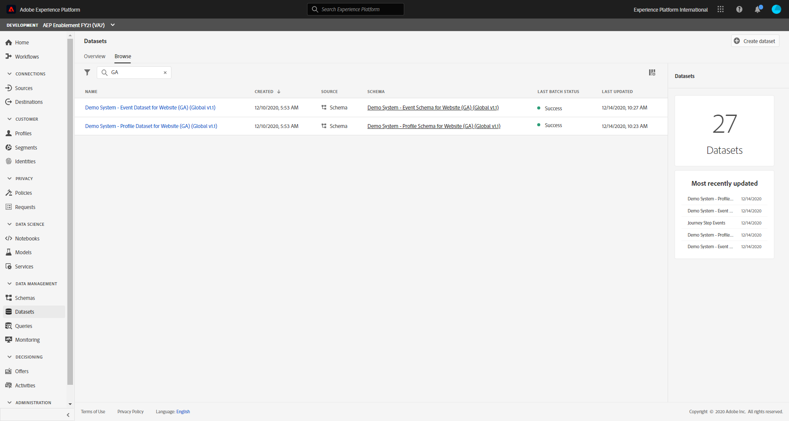

And by opening the `Demo System - Event Dataset for Website (GA) (Global v1.1)`-dataset you can see all individual ingested batches for this dataset.

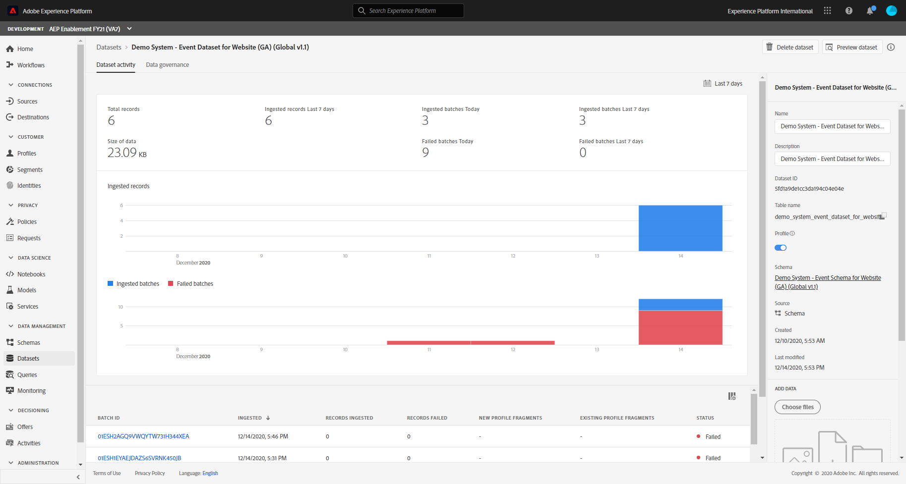

By clicking on **Preview**, you can see a preview of the ingested data.

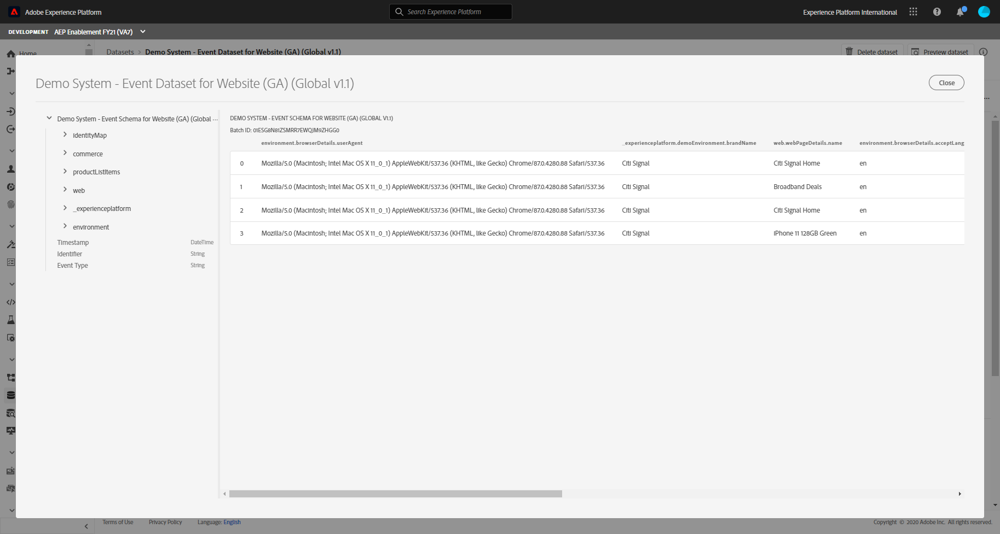

You can do the same thing for the `Demo System - Profile Dataset for Website (GA) (Global v1.1)` dataset:

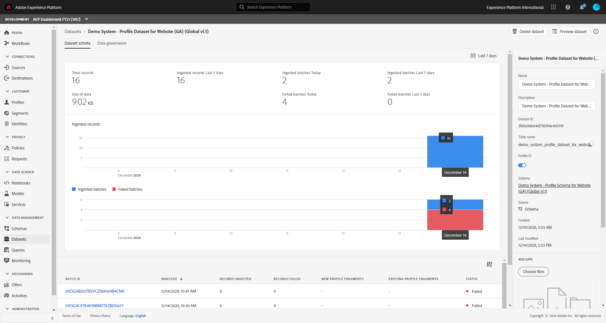

Also have a look at the **Preview** of Profile Data to retrieve your ingested data.

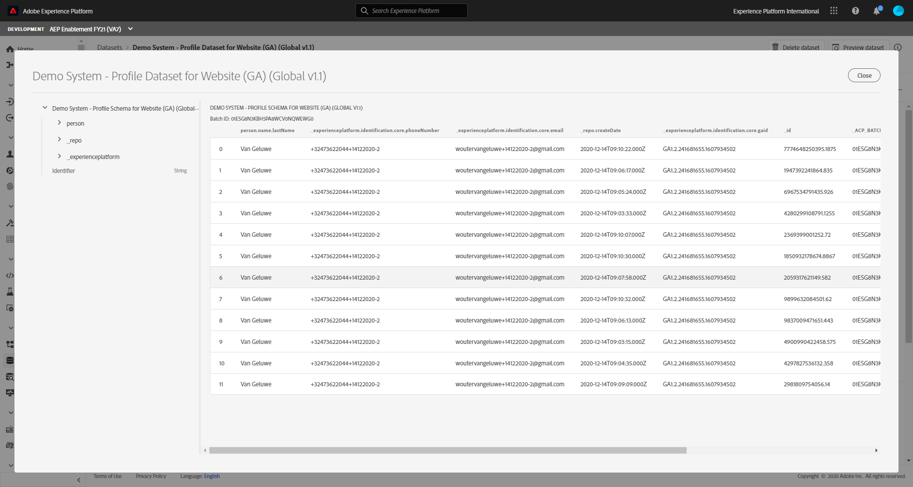

Next Step: [Summary and benefits](./summary.md)

[Go Back to Module 9](./data-ingestion-using-google-tag-manager-and-google-analytics.md)

[Go Back to All Modules](../../overview.md)
